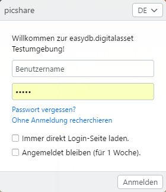
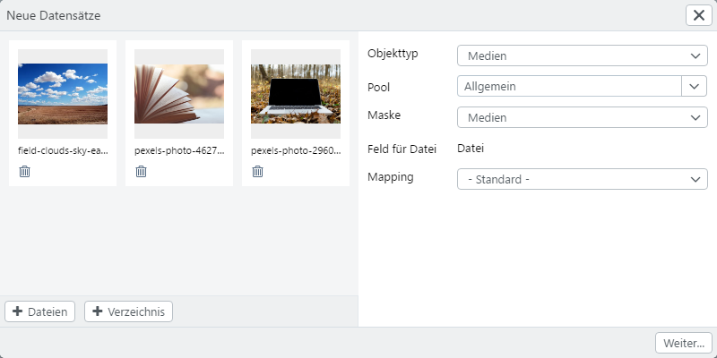
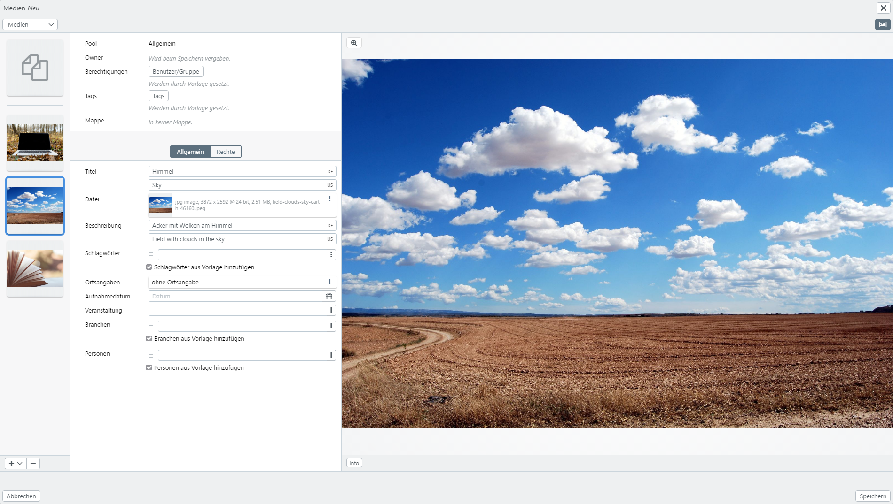
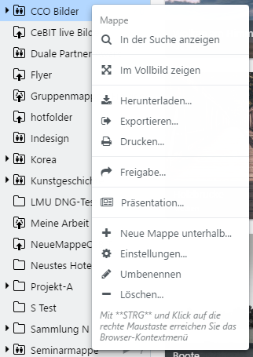
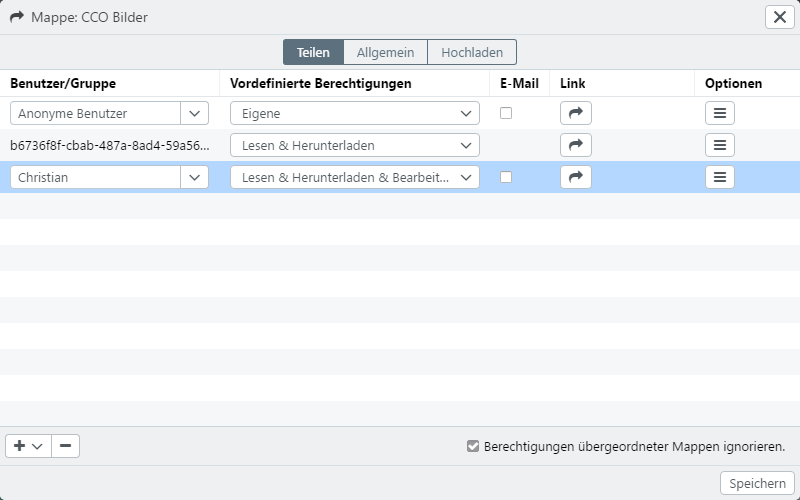

# Schnelleinstieg für Benutzer

Diese Kurzanleitung dient der ersten Orientierung in easydb. Für den Überblick ist hier in wenigen Schritten der Einstieg für Benutzer in easydb erklärt. Die Kurzversion enthält die am häufigsten genutzten Funktionen in easydb, von der Anmeldung, über das Hochladen der ersten Datei, bis zur Weiterverwendung der [Assets](../glossar). Eine ausführliche Anleitung ist im [Benutzer-Handbuch](../webfrontend) zu finden.

* [easydb starten](/de/getstarteduser)
* [Anmeldung/Login](/de/getstarteduser)
* [Aufbau](/de/getstarteduser)
* [Erstellen](/de/getstarteduser)
* [Suchen](/de/getstarteduser)
* [Ansehen und Downloaden](/de/getstarteduser)
* [Export](/de/getstarteduser)
* [Mappen-Freigabe](/de/getstarteduser)

# easydb starten

easydb wird über einen Webbrowser erreicht. Dafür werden lediglich ein funktionierender Internetanschluss und ein aktueller Webbrowser benötigt. Wir empfehlen die Verwendung von Chrome.

# Anmeldung

Bei der Anmeldung (Login) geben Sie Ihren Benutzernamen und Ihr Passwort ein, um sich in easydb anzumelden. Zusätzlich kann mithilfe der darunter liegenden Checkboxen angegeben werden, ob easydb bei jedem neuen Zugriff sofort mit der Eingabe der Login-Daten starten soll (anstatt die Rechercheansicht zu laden, von der aus über <code class="button">Anmelden</code> der Login gestartet werden kann). Und ob easydb den Login für eine Woche speichern soll.

> Nach dem Login können Benutzer ihre Einstellungen ändern. Näheres dazu ist unter [Benutzerverwaltung](../webfrontend/userprefs) zu finden.

## Aufbau

Grundlegend ist easydb in die unten abgebildeten Bereiche gegliedert. Je nach Rechtekonfiguration können Ihnen hier jedoch mehr oder weniger Optionen zur Verfügung stehen.

|Nr.|Bereich|Funktion|
|---|---|---|
|1|Menü|Durch Klick auf das Icon oben kann das Menü zur vollständigen Anzeige geöffnet werden. Berechtigte Administratoren haben hier Zugang zu den Systemeinstellungen. |
|2|Schnellzugriff|Der als Schnellzugriff bezeichnete Bereich kann mit dem Pfeil oben ein- und ausgeblendet werden. Hier werden gespeicherte Suchen, eigene und freigegebene Mappen angezeigt und verwaltet. |
|3|Detailansicht für Mappen|Durch Doppelklick auf eine Mappe öffnet die Detailansicht für Mappen neben dem Finder. Über <code class="button">X</code> kann die Datailansicht wieder ausgeblendet werden. Über den Button <i class="fa fa-columns" aria-hidden="true"></i> oben rechts kann die Suche neben der Detailansicht angezeigt werden. |
|4|Recherche|Wird angezeigt, wenn man im Menü Recherche wählt. Dient der Suche und der Anzeige von Treffern. |
|5|Detailansicht und Editor|Treffer aus der Suche können im Vollbild oder neben der Suche in der Detailansicht angezeigt werden. Berechtigte Benutzer können hier in den Editor zum Bearbeiten von Datensätzen wechseln.|
|5|Einstellungsbereich für Benutzer|Durch Klick auf die Icons können Downloads angezeigt und Benutzer- sowie Spracheinstellungen geändert werden.|

> Details zu den jeweiligen Funktionen und Bereichen sind im [Benutzer-Handbuch](../webfrontend) ausführlich beschrieben.

# Erstellen

## Hochladen

Über das Menü links können berechtigte Benutzer mit <code class="button">+ Neue Datensätze...</code> Dateien in easydb hochladen und neue Datensätze erzeugen.

Mit dem Aufruf des Neu-Editors öffnet ein neues Fenster zum Hochladen neuer Dateien bzw. zum Anlegen neuer Datensätze. Über die Buttons <code class="button">+Dateien</code> und <code class="button">+Verzeichnis</code> können wahlweise einzelne Dateien oder ganze Verzeichnisse hochgeladen werden. Mit entsprechender Berechtigung kann hier angegeben werden

* um was für einen `Objekttyp` es sich handelt,
* welchem `Pool` die neuen Datensätze zugeordnet werden sollen,
* welche `Maske` für das Editieren weiterer Informationen (Metadaten) genutzt und
* welches `Mapping` zum Auslesen der Metadaten aus der Datei verwendet werden soll.

Durch Klick auf <code class="button">Weiter...</code> wird die Vorlage zur weiteren Bearbeitung der Metainformationen geöffnet.

## Editieren

In der Vorlage werden, entsprechend der gewählten Maske, Informationen zu den Datensätzen editiert. Diese können über die Vorlage ganz oben links für alle Datensätze vorgenommen werden oder durch Auswählen der einzelnen Datensätze in der linken Sidebar individuell angepasst werden. In diesem Beispiel ist das Feld mit der Bezeichnung `Titel` als Pflichtfeld markiert. Ein Pflichtfeld als Mindestanforderung ist hilfreich für die Recherche, um die Suche nach Datensätzen über die ID hinaus zu gewährleisten. Weitere Pflichtfelder können vom zuständigen easydb Administrator in den Einstellungen für das Datenmodell festgelegt werden. Wenn alle erforderlichen oder gewünschten Informationen hinzugefügt wurden, kann der Vorgang durch <code class="button">Speichern</code> rechts unten abgeschlossen und die Daten in easydb geladen werden.

> Weiterführende Informationen zum Hochladen und Editieren von Datensätzen befinden sich im Kapitel [Neue Datensätze](../webfrontend/datamanagement/new_objects). Näheres zur Anpassung des Datenmodells ist unter [Administration](../webfrontend/administration/datamodel) zu finden.

# Suchen

Dem Benutzer stehen in easydb unterschiedliche Suchfunktionen zur Verfügung. Die unterschiedlichen Optionen befinden sich in der Rechercheansicht oberhalb der Ergebnisanzeige.

* Pools: Auswahl in welchem Pool gesucht werden soll
* Objekttypen: Auswahl des Objekttyps, der durchsucht werden soll
* Einfache Suche im freien Textfeld: Texteingabe mit Autovervollständigung und Anzeige von Vorschlägen, Kombination durch Und/Oder-Verknüpfungen (Boolsche Operatoren)
* Filter: Suche in gruppierten Datensätzen. Verknüpfte Listeneinträge können über Checkboxen selektiert werden.
* Anzeigeoptionen: Standard, Text, Tabelle und variable in Größe, Format, Datei-Info, Information zu Objekttyp, Pool, Tags und Treffer pro Seite
* Expertensuche: Gezielte Suche in den einzelnen Feldern aus dem Erfassungsbereich oder anhand weiterer Metainformationen, wie Changelog, System-ID, etc.
* Sortierung: nach 1. und 2. Kriterium mit Angabe der Richtung und Eingrenzung bei weiteren Optionen
* Zusätzliche Optionen: Auswählen, Auswahl filtern, Zurücksetzen, Auswahl per Link teilen, Suche speichern, Suche exportieren

> Im Benutzerhandbuch unter [Recherche](../webfrontend/datamanagement/search) werden alle Details zur Suche und zu den weiteren Optionen detailliert erläutert.

# Ansehen und Herunterladen

Nach einer Suche werden die Treffer im Ergebnis angezeigt. Durch Klick mit der linken Maustaste auf einen Treffer wird der ausgewählte Datensatz rechts in der Detailansicht angezeigt. Sind unterschiedliche Masken für den Objekttyp definiert, können je Maske dabei unterschiedliche Sets von Feldern ausgegeben werden. Über den Button <i class="fa fa-download"></i> oben rechts kann der Datensatz in verschiedenen Varianten heruntergeladen werden.

Durch Klick mit der rechten Maustaste auf einen Treffer oder eine Auswahl öffnet ein Kontextmenü. Das Kontextmenü bietet Optionen für die Anzeige und Weiterverwendung der Auswahl, der Datei, des Datensatzes und der Suche an.

# Export

Exporte aus der easydb lassen sich für alle Datensätze aus dem Bereich der Datenverwaltung (Recherche, Mappen, Listen) erzeugen. Es gibt unterschiedliche Möglichkeiten einen Export anzulegen:

* Einzelner Datensatz (Rechtsklick im Suchergebnis)
* Auswahl (Rechtsklick auf einen ausgewählten Datensatz)
* Mappen (Rechtsklick auf eine Mappe)
* Suche (Rechtsklick im Suchergebnis)

Zum Erzeugen des Exports öffnet ein Dialog, in dem Angaben zum Export und Details zum Ausführen des Exports festgelegt werden.

Datensätze können aus der easydb in den Formaten CSV, XML oder JSON exportiert werden. Über das Icon <i class="fa fa-download"></i> rechts oben über dem Editor öffnet ein Dialog, in dem der aktuelle Status aller Exporte dokumentiert ist.

Für Mappen kann der Export über das Kontextmenü der Mappen oder über die Detailanzeige für eine Mappe erzeugt werden.

# Mappen-Freigabe

Mappen dienen in der easydb dem Gruppieren von Datensätzen. So kann eine Auswahl aus einem oder aus mehreren Pools in einer Mappe gespeichert werden. Durch das Rechtemanagement können diese Mappen anderen Benutzern zur Verfügung gestellt, per E-Mail freigegeben oder über einen anonymen Link geteilt werden.

Freigaben für Mappen können für einzelne Benutzer, Gruppen der easydb oder externe Benutzer ohne Registrierung in easydb erzeugt werden. Die Freigabe kann per E-Mail oder Link erfolgen. Der Zugriff auf die Mappe (lesen, bearbeiten, löschen, hochladen) wird über die mitgegebenen Berechtigungen gesteuert. Wenn vom easydb Administrator konfiguriert, kann aus `vordefinierten Berechtigungen` gewählt werden oder über die erweiterten Optionen eigene Berechtigungen gesetzt werden.

> Mehr zum Thema ist innerhalb des Kapitels [Schnellzugriff](../webfrontend/datamanagement/search/quickaccess) zu finden.
