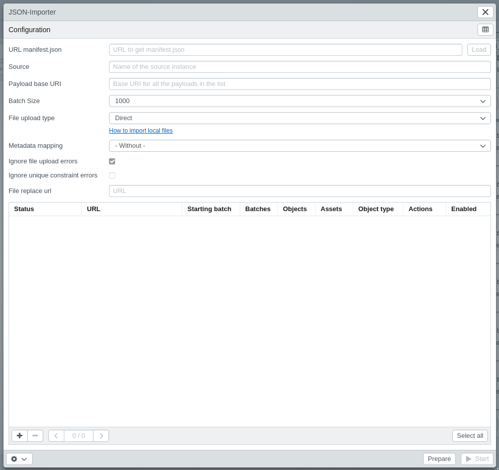

# JSON Importer

The JSON importer can be used to bulk import data in [JSON format](/en/technical/datamanagement/jsonimport/).

The importer can be found under "Lists &gt; JSON Import".

The configuration for the JSON importer can be uploaded in a manifest file \(.json\). The manifest contains payloads and other information which will preset the importer.

## Frontend form

Fields:

* URL manifest.json: \(Optional\) This is a URL to get the manifest.json by clicking 'Load' button next to the input.
* Source: \(Optional\) Name of the source instance.
* Payloads base URI: \(Optional\) Base URI for all the payloads in the list. It will be prepended to each payload. The default value will be the same base URL of the manifest.
* Batch size: Quantity of objects pushed to the server per request.
* File upload type: See [Import files](../csvimport/examples/files/)
* Metadata mapping: \(Optional\) Metadata mapping used for files.
* Ignore file upload errors: When checked, all errors of file uploads will be ignored and the import process will continue. All errors will be available in the logs.
* Ignore unique constraint errors: When checked, all 'constraint' errors from the server will be ignored.
* File replace url: \(Optional\) The location for each file URL will be replaced by the value configured here.
* Payload list: This list show all available payloads. It is possible to see the content by clicking them.
    * Status: Current status of the payload. Pending/Success/Error
    * URL: The url of the payload
    * Starting batch: Number of the starting batch. As default the first one is selected, so all batches are processed.
	* Batches: Quantity of batches (they will depend on the quantity of objects and the selected batch size)
	* Objects: Quantity of objects.
	* Object type
	* Actions
		* Open the payload in a new tab.
	* Enabled: Checkbox to enable or skip the payload (Ctrl+Click to select/unselect all in the selected page, or click in the button below to select/unselect in all pages)

Buttons:

* Right side:
	* Prepare: It is necessary to click on this button to make some validations before starting the import process
	* Start: It starts the import of all the enabled payloads.
* Left side:
	* Download logs in CSV format.
	* Clear the logs
	* See the last report generated.

