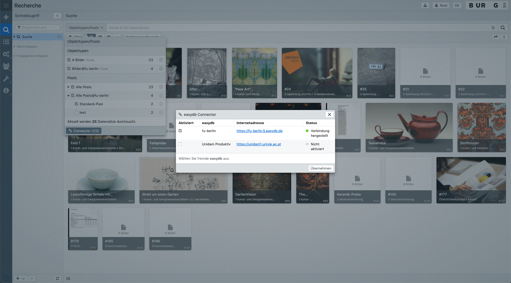

# Tutorial: Connector

Der Connector ermöglicht es Ihnen sich mit anderen easydb's zu verbinden. In diesem Tutorial finden Sie alle notwendigen Schritte um

1. einen Connector-Partner in Ihrer easydb einzubinden, und um
2. Ihre easydb über den Connector-Verbund bereitzustellen.

### 1. Connector in Ihre easydb einbinden

Um eine easydb in Ihrer Instanz über den Connector einzubinden, benötigen Sie zunächst folgende Informationen von Ihrem Connector-Partner:

- URL
- Login
- Passwort

> Hinweis: Ihr Connector-Partner muss die unter 2. aufgeführten Schritte durchgeführt haben.

Übermitteln Sie Ihrem Connector-Partner Ihre easydb-URL und bitten ihn diese im Bereich ["Basis-Konfiguration"](../../webfrontend/administration/base-config/) > ["Allgemein"](../../webfrontend/administration/base-config/general) als "Erlaubte Herkunftsadresse" einzutragen.

Melden Sie sich nun als Administrator in Ihrer easydb an und wechseln in den Bereich ["Basis-Konfiguration"](../../webfrontend/administration/base-config/) > ["Connector"](../../webfrontend/administration/base-config/connector) und tragen dort die oben genannten Daten Ihres Connector-Partners ein und aktivieren die Verbindung für die Benutzer.

Ab diesem Schritt können Ihre Nutzer in der Recherche über die Auswahl "Objekttypen/Pools" den eingerichteten Connector-Partner auswählen und in dessen freigegebenen Bestände recherchieren.

### 2. Ihre easydb für Connector-Partner einrichten

Damit Ihre Connector-Partner auf Ihre easydb zugreifen können, müssen Sie zu allererst bestimmen auf welche Inhalte diese Zugriff erhalten sollen.

Legen Sie hierzu zunächst im Bereich ["Nutzer"](../../webfrontend/rightsmanagement/users) einen neuen Nutzer-Account an und vergeben im Reiter "Systemrechte" das Recht "Connector-Verbindungen von anderen easydbs aus über diesen Nutzer zulassen" sowie die Frontend-Funktion "Herunterladen" falls Sie Ihrem Connector-Partner den Download ermöglichen wollen. 

> Wir empfehlen für jeden Connector-Partner einen eigenen Nutzer-Account einzurichten, da Sie so die Möglichkeit haben Ihre Inhalte ganz gezielt freizugeben.

Legen Sie nun im Bereich ["Pools"](../../webfrontend/rightsmanagement/pools) fest, auf welche Inhalte Ihr Connector-Partner Zugriff erhalten soll indem Sie im Reiter "Berechtigungen" eine neue Zeile hinzufügen und die notwendigen Lese- und Download-Berechtigungen für den zuvor angelegten Nutzer vergeben. Wiederholen Sie dies für alle Pools und ggfs. im Bereich "Tags & Workflows".

> Bitte beachten Sie, dass Sie bei den Berechtigungen min. die Rechte "Datensätze ansehen" und "Erlaubte Masken" vergeben müssen.

Damit die Nutzer des Connector-Partners auch die Expertensuche nutzen können, erteilen Sie auch im Bereich ["Objekttypen"](../../webfrontend/rightsmanagement/objecttypes) alle notwendigen Rechte an den Connector-Nutzer.

Senden Sie zu guter Letzt Ihre URL, den Login sowie das Passwort Ihrem Connector-Partner und tragen seine URL im Bereich ["Basis-Konfiguration"](../../webfrontend/administration/base-config/) > ["Allgemein"](../../webfrontend/administration/base-config/general) unter "Erlaubte Herkunftsadressen" ein.

