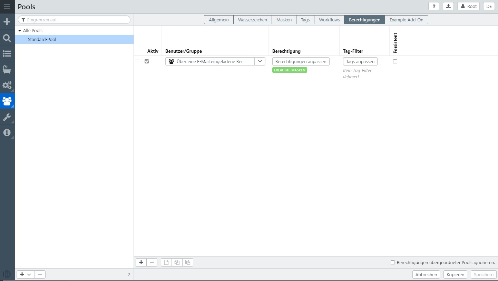
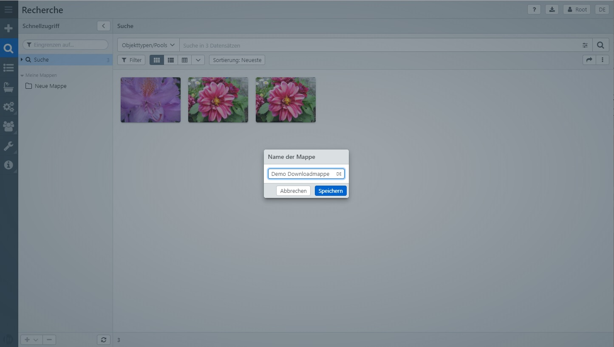
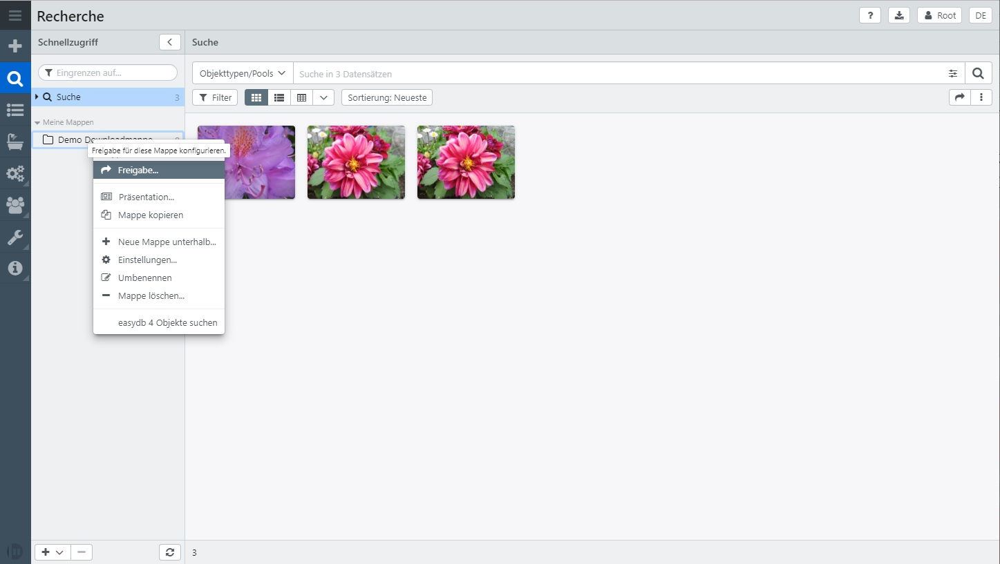
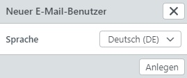
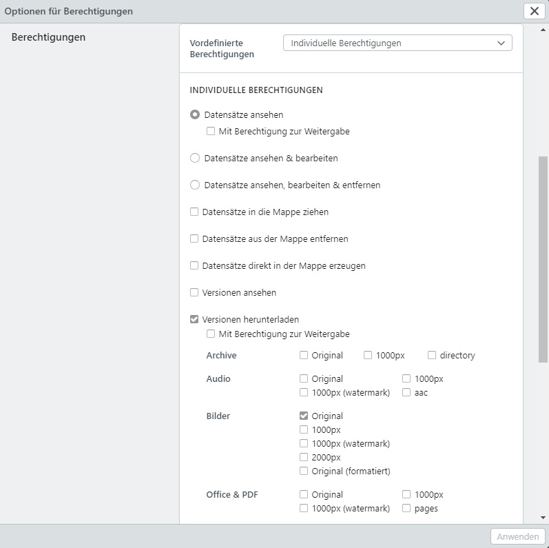
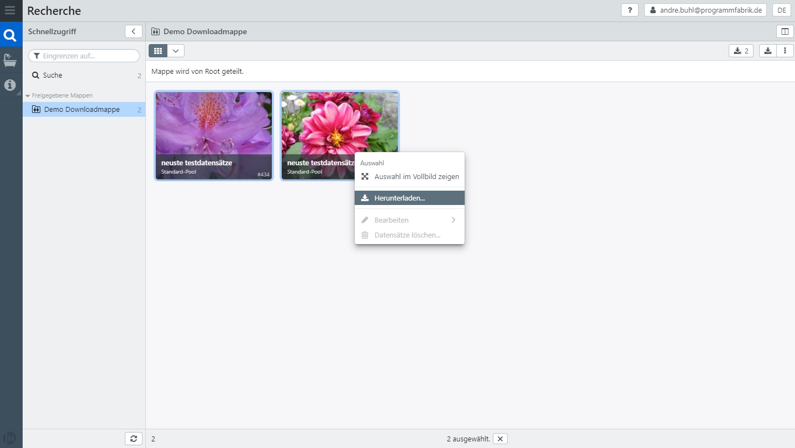

# Tutorial:  Download-Mappe für z.B. E-Mail-Nutzer konfigurieren & nutzen

Die Mappen-Freigabe in easydb ist sehr mächtig. Sie können zum Beispiel Datensätze über eine Arbeitsmappe an Nutzer freigeben, die sonst generell keine Berechtigungen auf jegliche Datensätze in easydb haben. Nachstehend ein exemplarisches Beispiel:

1. Setzen von Systemrechten

- Zu Beginn müssen die grundlegenden Systemrechte konfiguriert werden. In diesem Tutorial wollen wir einem E-Mail-Nutzer den Download auf in einer Arbeitsmappe befindliche Assets gewähren. Da es sich hierbei um einen E-Mail-Nutzer handelt, bedienen wir uns der Systemgruppe "Über eine E-Mail eingeladene Benutzer."
- Öffnen Sie die Übersicht aller Gruppen.
- Öffnen Sie die Gruppe "Über eine E-Mail eingeladene Benutzer" im Editor.
- Wechseln Sie in den Reiter "Systemrechte" und aktivieren Sie folgende Berechtigungen:
  - Zugriff auf Recherche
  - Frontend-Funktionen
    - Herunterladen
- Diese drei Checkboxen stellen das Mindest-Set dar. Sie können natürlich auch weitere Berechtigungen erlauben.

2. Setzen von Poolrechten

- Damit ein Nutzer einen Datensatz überhaupt ansehen kann, benötigt dieser immer mindestens zwei Berechtigungen:
  - WAS: Mit welchem Recht darf der Nutzer den Datensatz öffnen? Ansehen, Bearbeiten, Löschen.
  - WIE: Wie soll der Datensatz dem Nutzer angezeigt werden? Erlaubte Maske.
- Da wir später bei den Mappen-Berechtigungen das WAS setzen, müssen wir bei den Poolberechtigungen das WIE setzen.
- Öffnen Sie dazu einen beliebigen Pool. Wenn Sie nur über eine Maske für E-Mail-Nutzer verfügen, sollten Sie die Berechtigung auf Ebene "Alle Pools" setzen. In diesem Beispiel nutzen wir nun den "Standard-Pool".
- Fügen Sie eine weitere Rechtezeile hinzu.
- In der Spalte "Benutzer/Gruppe" wählen Sie die Systemgruppe "Über E-Mail eingeladene Benutzer" aus.
- Klicken Sie auf die Schaltfläche "Berechtigungen anpassen".
- Wählen Sie hier nur die "Erlaubt Maske" z.B. "Standard".
- Speichern Sie Ihre Einstellungen.

3. Setzen von Mappenberechtigungen

- Im Recherche-Bereich legen Sie eine neue Mappe an.
- Vergeben Sie einen beliebigen Namen für die Mappe und bestätigen Sie Ihre Eingabe durch Klick auf "Speichern."

- Anschließend öffnen Sie das Kontextmenü dieser Mappe durch Rechtsklick.
- Im Kontextmenü wählen Sie "Freigabe".

- Fügen Sie eine neue Rechtezeile durch Klick auf das Plus-Zeichen hinzu.
- Vergeben Sie hier die E-Mail des Nutzers. Ist die E-Mail-Adresse noch nicht dem System bekannt, wird die Schaltfläche "EMAIL + anlegen" angezeigt. Klicken Sie auf diese Schaltfläche.
- Aktivieren Sie Checkbox in der Spalte "E-Mail" damit der Nutzer nach dem Speichern eine E-Mail erhält.

- Anschließend erscheint die Sprachen-Auswahl.
- Bestätigen Sie Ihre Auswahl durch Klick auf "Anlegen".

- Im nächsten Schritt klicken Sie in der Rechtezeile auf "Optionen" um die Rechte-Einstellungen vorzunehmen.
- Aktivieren Sie mindestens die Checkboxen "Datensätze ansehen" und "Versionen herunterladen".
  - Optional können Sie weitere Versionen wählen als hier im Screenshot abgezeigt.
- Wählen Sie bei "Datensätze ansehen" nicht de Checkbox "Mit Berechtigung zur Weitergabe". Diese nutzen Sie nur, wenn Sie dies wirklich wünschen. Bei Aktivierung dieser Checkbox könnte der E-Mail-Nutzer seine Berechtigungen wiederum an einen Dritten übertragen.
- Bestätigen Sie Ihre Eingaben durch Klick auf die Schaltfläche "Anwenden".

- Nachdem Sie die Arbeitsmappe gespeichert haben, erhält der Nutzer folgende E-Mail in seinem Postfach.

- Mit Klick auf den Link in der E-Mail gelangt der Nutzer direkt zur Arbeitsmappe in easydb und kann die Datensätze herunterladen.

