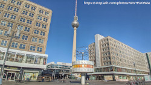

[&lArr; 3. Searching for objects](../get_started_3_search/)

----

# 4. Rendering objects based on masks

This last tutorial step shows how the objects, which have been returned by the different api endpoints, can be displayed. This means reading the actual user data from objects and displaying the values together with the translated field names. This basically is a simplified description of how the easydb frontend renders objects.

Here, the objects are displayed in a [simple table view](#rendered-objects-example), which displays the translated field names in english and german, and the field value next to it. The objects are parsed from the array in a search result. For this example, the search returned two objects of the `"main"` objecttype, including linked objects, assets and nested tables:

<a name="search_result_main"></a>

[&uArr; go to beginning of this snippet](#search_result_main)

## Iterating over fields based on the mask

The mask in which the objects are returned is the basis for parsing fields from objects. The corresponding field definitions in the schema are used to get information about the field type. Depending on the field type, the field value is parsed and displayed in different ways. Both objects in the `"object"` array are of `"_objecttype": "main"` and `"_mask": "main__standard"`.

The best approach is to find the specified mask in the [maskset](../get_started_1_datamodel/#masks-for-objecttypes) by the mask name. For each field in the mask which is not hidden (`"edit": { "mode": "off" }`), check if the corresponding path to the value in the object JSON is set. If there is a value, it can be displayed. To determine what is to do to properly render the value, find the corresponding column in the [schema](../get_started_1_datamodel/#objecttypes-and-fields-in-the-schema) to get the field type. To show the field name in the correct translation, find the name of the column in the [schema localization](../get_started_1_datamodel/#localization).

The fields of the `"main"` objecttype in the `"main__standard"` mask have the following fields:

| Field | Type | English localization | German localization | Path to the field in JSON | Display value |
|---|---|---|---|---|---|
| `title` | `text_oneline` | *Title* | *Titel* | `"objects[0].main.title"` | Text can be displayed as is |
| `description` | `text_oneline` | *Description* | *Beschreibung* | `"objects[0].main.description"` | Text can be displayed as is |
| `picture` | `eas` | *Picture* | *Bild* | `"objects[0].main.picture"` | [Show file](#display-files) using asset url |
| `place` | link to objecttype `place` | *Place* | *Ort* | `"objects[0].main.place"` | [Load linked object](#load-linked-objects), iterate over mask of loaded object |
| `keywords` | nested table | *Keywords* | *Schlagwörter* | `"objects[0].main._nested:main__keywords"` | [Iterate over fields](#parse-nested-tables) in nested table |

Simple fields (text, numbers, boolean) can be displayed directly. For the first object in the array, these values are:

| | |
|---|---|
| `main.title` | `"Example Object"` |
| `main.description` | `"This is an example object to show the structure of easydb objects"` |

Other special fields need to be parsed and require additional steps:

### Display files

Each `eas` field contains an array of [asset objects](/en/technical/types/asset/#attributes). One of these has the option `"preferred": true`. Only this asset should be rendered, all others should be ignored. Decide which [asset version](/en/technical/types/asset/#a-nameversionsa-versions) is fitting best.

Assuming there is no rights management restriction on the URLs of the asset, the file can be embedded by the direct `url`, or if it is available, by the `download_url`. For the first object, the *small* version of the asset is found at the key `objects[0].main.picture[0].versions.small.url`.

Additional information can be found in the top level of the asset. This is information that is the same for all versions, like the original file name. Other information is found in the [`technical_metadata`](/en/technical/types/asset/#attributes) block.

| | |
|---|---|
| `url` | `http://<instance>/eas/partitions-inline/2/0/0/193/458fd7bbd0d6a30510cbd2deaddb7195fe7a1429/image/jpeg` |
| `objects[0].main.picture[0].original_filename` | `image_1.jpg` |
| `objects[0].main.picture[0].versions.small.width` | `250` |
| `objects[0].main.picture[0].versions.small.height` | `141` |

### Load linked objects

Linked objects are only rendered in the `standard` format, which contains the standard text of the linked object, which can be used as a simple preview of the actual object.

If you want to also render the complete linked object (including its assets, links and nested tables), you can load the object from the database or search for it. To identify the object, the ids are included in the link json object. The mask in which the linked object should be rendered is also given.

| | |
|---|---|
| `objects[0].main.place._mask` | `"place__standard"` |
| `objects[0].main.place.place._id` | `4` |
| `objects[0].main.place._system_object_id` | `4` |

Using the [`db` API](/en/technical/api/db/#retrieve-objects) you can load (single) objects:

- with `_id`: `GET http://<instance>/api/v1/db/place/place__standard/4`
- with `_system_object_id`: `GET http://<instance>/api/v1/db/place/place__standard/system_object_id/4`

Using the search api, you can search for one or more objects. The most simple way to do this is searching for objects by their `_system_object_id`:

```
POST http://<instance>/api/v1/search

{
    "search": [
        {
            "bool": "must",
            "type": "in",
            "in": [
                4                       // one or more system object ids of linked objects
            ],
            "fields": [
                "_system_object_id"     // search for ids in field "_system_object_id"
            ]
        },
        {
            "bool": "must",
            "type": "in",
            "in": [
                "bestand__bearbeitung"  // one or more mask names of linked objects
            ],
            "fields": [
                "_mask"                 // search for mask names in field "_mask"
            ]
        }
    ],
    "format": "long"                    // return result with all fields (limited by mask settings)
}
```

The results of the requests have exact same structure as described [before](../get_started_2_structure/). Since the structure of linked objects is always the same, this process of loading and parsing linked objects can always be repeated into deeper levels in a recursive way.

From the linked `place` object, these values can be parsed:

| | |
|---|---|
| `objects[0].place.name` | `"Berlin"` |

### Parse nested tables

Nested tables are an array of objects of the same structure, which each contain the data for one row of the nested table. For each entry in a nested table, the same recursive parsing that is described here, must be done, including parsing asset fields, loading linked objects, and iterating over other nested tables:

| Row | Field | Type | English localization | German localization | Path to the field in JSON | Display value |
|---|---|---|---|---|---|---|
| 0 | `comment` | `text_oneline` | *Comment for keyword* | *Kommentar zum Schlagwort* | `"objects[0].main["_nested:main__keywords"][0].comment"` | Text can be displayed as is |
| 0 | `keyword` | link to objecttype `keyword` | *Keyword* | *Schlüsselwort* | `"objects[0].main["_nested:main__keywords"][0].keyword"` | [Load linked object](#load-linked-objects), iterate over mask of loaded object |
| 1 | `comment` | | | | `"objects[0].main["_nested:main__keywords"][1].comment"` | *Field is not set in this row, so no value can be displayed* |
| 1 | `keyword` | link to objecttype `keyword` | *Keyword* | *Schlüsselwort* | `"objects[0].main["_nested:main__keywords"][1].keyword"` | [Load linked object](#load-linked-objects), iterate over mask of loaded object |

After the linked `keyword` objects have been loaded, these values are parsed from the nested table:

| Row | | |
|---|---|---|
| 0 | `comment` | `"Link to an example keyword object"` |
| 0 | `keyword.name` | `"Example"` |
| 1 | `keyword.name` | `"Example Keyword 2"` |

## Rendered Objects Example

| # | EN | DE | Value |
|---|---|---|---|
| `Object 1` | `Main` | `Hauptobjekt` | |
| | `Title` | `Titel` | *"Example Object"* |
| | `Description` | `Beschreibung` | *"This is an example object to show the structure of easydb objects"* |
| | `Picture` | `Bild` | <br/>*image_1.jpg, 250x141* |
| | `Place` | `Ort` | "*Berlin*" |
| | `Keywords` | `Schlagwörter` | <ol><li>*"Example (Link to an example keyword object)"*</li><li>*"Example Keyword 2"*</li></ol> |
| | | | |
| `Object 2` | `Main` | `Hauptobjekt` | |
| | `Title` | `Titel` |  *"2nd Example"* |
| | `Description` | `Beschreibung` |  *"Another example object"* |
| | `Picture` | `Bild` | <br/>*image_2.jpg, 195x250* |
| | `Place` | `Ort` |  *"Zürich"* |
| | `Keywords` | `Schlagwörter` | <ol><li>*"Example"*</li></ol> |

----

[&lArr; 3. Searching for objects](../get_started_3_search/)
