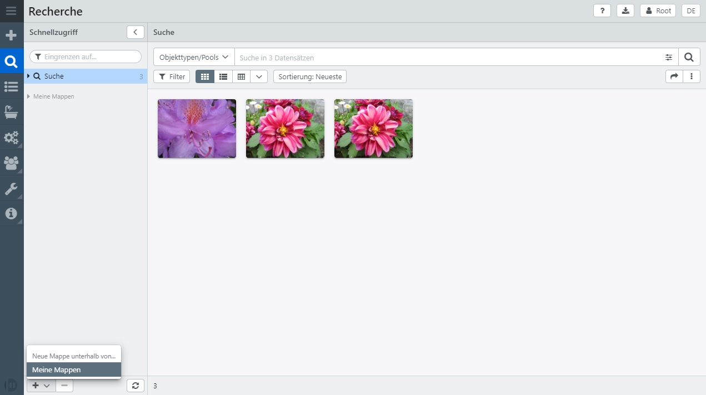
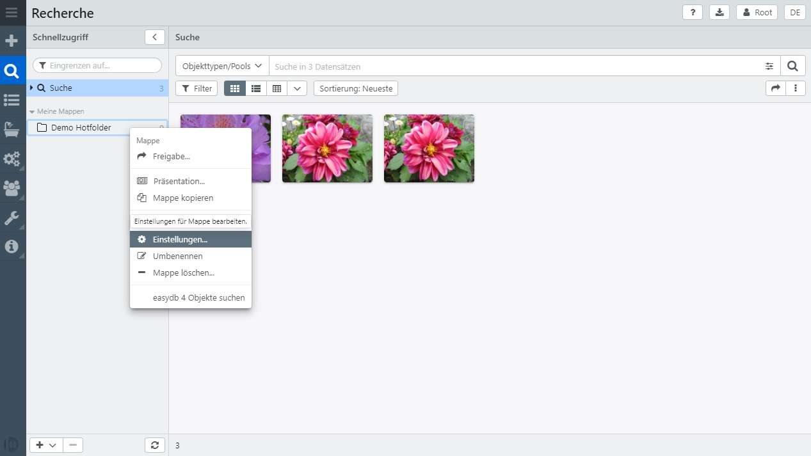
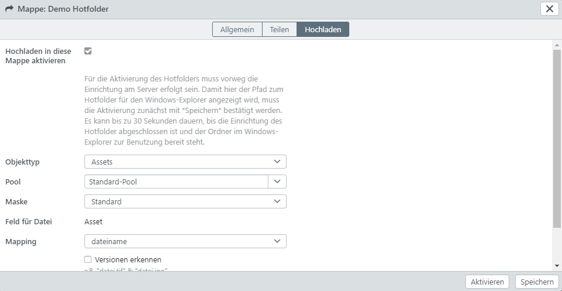
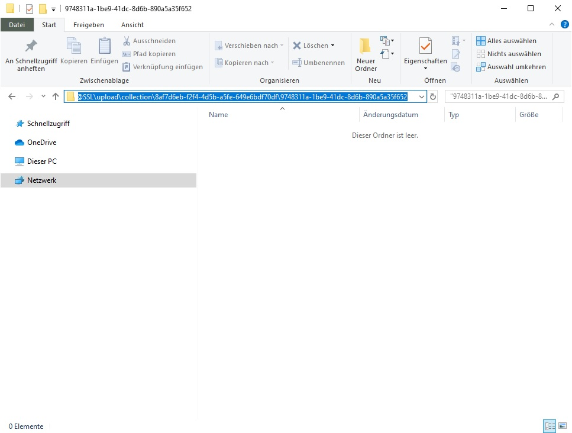

# Hotfolder konfigurieren und benutzen

Der Hotfolder ermöglicht das Vereinnahmen von Assets via Server, anstatt diese über das Frontend hochzuladen.

Der Hotfolder bietet sich besonders bei den folgenden Anwendungsbereichen an:
* Vereinnahmen von großen Mengen an Assets für den Import in easydb
* Hotfolder für externe Fotografen, die Fotos in easydb importieren sollen ohne dabei Zugriff auf das Frontend zu haben
* Import von Assets für z.B. Azubis oder Hiwis, die sonst keine Bilder hochladen dürfen

Ist der Hotfolder in Ihrer easydb freigeschaltet und konfiguriert, gehen Sie wie folgt vor:

- Legen Sie eine neue Mappe über die Schlatfläche "Plus-Zeichen" an.

- Vergeben Sie einen Namen für die Mappe und bestätigen Sie Ihre Eingabe durch Klick auf "Speichern".

- Anschließend erscheint die neue Mappe in der Sidebar "Schnellzugriff". Klicken Sie auf die Mappe mit der rechten Maustaste, sodass sich das Kontextmenü öffnet. Klicken Sie nun auf "Einstellungen".

- Es erscheint das Popup für die Mappeneinstellungen. Im Reiter "Hochladen" finden Sie die Einstellungen für den Hotfolder.
- Aktivieren Sie die Mappe für den Upload durch Aktivieren der Checkbox "Hochladen in diese Mappe aktivieren".
- Wählen Sie die gewünschten Einstellungen:
  - Objekttyp: Angabe um welchen Objekttyp es sich hier handelt.
  - Pool: In welchen Pool sollen die hier hochgeladenen Assets geschoben werden?
  - Maske: Mit welcher Maske sollen die Datensätze vereinnahmt werden?
  - Feld für Datei: Haben Sie mehrere Dateifelder bei diesem Objekttyp, können Sie hier ein Feld auswählen.
  - Mapping: Das hier angegebene Mapping wird beim Import automatisch durchgeführt. Dies ist von Vorteil, wenn z.B. externe Fotografen ihre Bilder über einen Hotfolder importieren und jeweils Felder in IPTC und XMP befüllen. Auf diese Weise können Sie für jeden Fotografen einen eigenen Hotfolder mit einem individuellem Mapping anlegen.

- Nachdem Sie alle Einstellungen konfiguriert haben, bestätigen Sie Ihre Angaben durch Klick auf die Schaltfläche "Speichern".
- Anschließend öffnen Sie erneut die Arbeitsmappen-Einstellungen durch Rechtsklick auf die Mappe und wählen im Kontextmenü Einstellungen.
- Wechseln Sie in den Reiter "Hochladen".
- Nun erscheint hier eine URL in der Zeile "Windows-Explorer".

- Kopieren Sie diese Zeile, indem Sie den Inhalt des Feldes markieren und Strg+C (Kopieren) auf der Tastatus drücken.
- Öffnen Sie unter Windows ein Explorer-Fenster und markieren die Zeile für die Zieladresse.
- Drücken Sie nun auf Ihrer Tastatur Strg+V (Einfügen) und bestätigen Sie Ihre Eingabe mit der Enter-Taste.

- Sie gelangen nun zum Hotfolder-Verzeichnis. Kopieren Sie Ihre Dateien von z.B. Ihrem Computer oder einem Netzlaufwerk in diesen Ordner.
- Nach wenigen Sekunden wird easydb beginnen die Dateien zu vereinnahmen.
- Die Datein werden bei erfolgreichem Import aus diesem Ordner gelöscht.
- Ist der Import einer Datei nicht erfolgreich, erscheint neben der Datei eine Text-Datei mit gleichem Dateinamen+"_Error". In dieser Text-Datei wird ein Hinweis ausgegeben, weshalb diese Datei nicht importiert werden konnte.