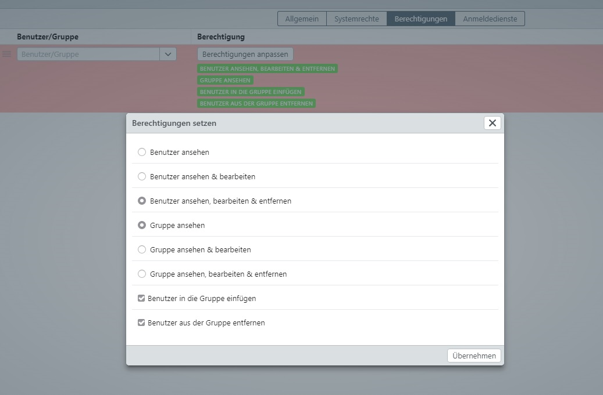

# Mandantenfähigkeit auf Basis des Rechtemanagements

Über das [Rechtemanagement](/de/webfrontend/rightsmanagement) in easydb können administrative Zuständigkeiten für Fachbereiche oder Abteilungen, die auf Poolebene abgebildet werden, getrennt werden. Für die jeweiligen Pools wird dementsprechend je ein Admin eingerichtet. In dem nachfolgenden Konfigurationsbeispiel werden unterschiedliche Fachbereiche (Pools) mit eigenen Administratoren und Benutzergruppen eingerichtet.

In diesem Beispiel werden 3 Benutzergruppen je Fachbereich angelegt:
* Fachbereich-Admins
* Fachbereich-Schreiben
* Fachbereich-Lesen

Über das Benutzerguppen-Management werden die Gruppen eingerichtet und die Rechte vergeben. Die Benutzergruppe Fachbereich-Admins benötigt folgende Systemrechte:
* Benutzer verwalten
* Pools verwalten

Die Fachbereich-Admins benötigen darüber hinaus Rechte an den Gruppen *Fachbereich-Schreiben* und *Fachbereich-Lesen*. Hierfür muss im Benutzerguppenmanagement an diesen beiden Gruppen jeweils im Reiter *Berechtigungen* eine neue Zeile hinzugefügt und die Fachbereich-Admins ausgewählt werden.

Folgende Checkboxen müssen da gesetzt werden:

Damit Fachbereich-Admins innerhalb des Fachbereich-Pools weitere Pools anlegen dürfen, benötigen sie die Berechtigung "Unterpools erzeugen" auf Ebene des Pools. Hierfür wird im Pool-Management der Fachbereich-Pool ausgewählt. Im Reiter Berechtigungen muss eine neue Zeile hinzugefügt und die Gruppe Fachbereich-Admins gewählt werden. Über *Berechtigungen anpassen* muss die Checkbox "Unterpools erzeugen" aktiviert werden.

Durch das Speichern der Einstellungen greifen die gesetzten Rechte und Berechtigungen an den Benutzergruppen und Pools.
