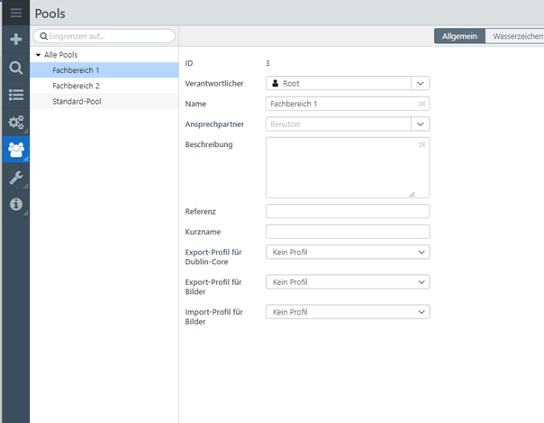
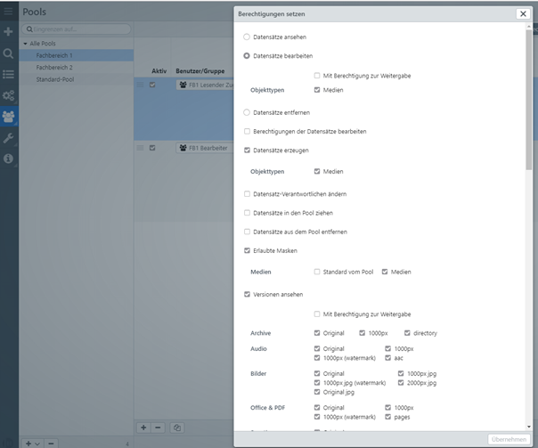
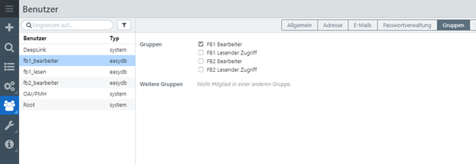

# Anlegen eines lesenden und eines schreibenden Benutzers

Dieses Tutorial beschreibt exemplarisch das Anlegen eines Benutzers und das Setzen der Rechte für einen „lesenden“ und einen „schreibenden“ Zugriff innerhalb eines Pools.

## Wichtiger Hinweis

Wir empfehlen Ihnen sämtliche Berechtigungen über Gruppen zu steuern und nicht über einzelne Nutzer. Berechtigungen an Nutzern machen nur dann Sinn, wenn es sich um einen Einzelfall handelt.

## Schritt 1: Pool anlegen

Legen Sie den Pool „Fachbereich 1“ an. Zu diesem Zeitpunkt müssen Sie noch keine weiteren Einstellungen vornehmen.

## Schritt 2: Gruppen anlegen

Legen Sie die Gruppen

- FB1 Lesender Zugriff

- FB1 Bearbeiter

an.

Für die Gruppen „FB1 Lesender Zugriff“ setzen Sie folgende Rechte:

- Zugriff auf Recherche
- Frontend-Funktionen
  - Herunterladen
  - Metadaten-Export „Standard

*Sie können später gern weitere Einstellungen vornehmen, aber für dieses einfache Beispiel reicht das erstmal*.

Für die Gruppe „FB1 Bearbeiter“ setzen Sie folgende Rechte:

- Zugriff auf Recherche
- Frontend-Funktionen
  - Herunterladen
  - Gruppeneditor verwenden
  - Gespeicherte Suchen verwenden
  - Präsentationen erstellen
- Listen verwalten

*Hinweis*

*Für beide Gruppen ist die Erlaubnis „Recherche“ zwingend erforderlich, da die Nutzer später sonst keinen Recherche-Bereich sehen. Alle anderen Einstellungen können Sie variieren. So könnte z.B. der Gruppeneditor für FB1 Bearbeiter nicht erlaubt werden und eine 3. Gruppe FB1 Power-User angelegt werden, die wiederum Zugriff auf die Extrafunktion Gruppeneditor hat.*

## Schritt 3: Pool-Berechtigungen

Bearbeiten Sie den in Schritt 1 angelegten Pool „Fachbereich 1“ im Reiter „Berechtigungen“. Fügen Sie zwei Rechtezeilen hinzu. Wählen Sie in Zeile 1 die Gruppe „FB1 Lesender Zugriff“ und in Zeile 2 Gruppe „FB1 Bearbeiter“ aus. Die Reihenfolge der Zeilen hat keinen Einfluss.

### Schritt 3a:  Berechtigungen für den "Lesenden Zugriff"

Bearbeiten Sie die Rechte der Gruppe „FB1 Lesender Zugriff“ indem Sie auf „Berechtigungen anpassen“ in dieser Rechtezeile klicken. Es öffnet sich ein Popup für weitere Einstellungen.

Setzen Sie für die lesende Gruppe folgende Einstellungen:

- Datensätze ansehen
  - Medien
- Erlaubte Masken
  - Medien
- Versionen ansehen
  - Wählen Sie hier die gewünschten Versionen aus.
- Versionen herunterladen
  - Wählen Sie hier die gewünschten Versionen aus.
- Pool ansehen

### Erklärungen zum lesenden Zugriff:

*Die Checkbox „Medien“ bei „Datensätze ansehen“ und „Erlaubte Masken“ ist zwingend erforderlich. Die meisten Datenmodelle werden hier nur einen Objekttyp anzeigen. Dennoch muss diese Checkbox gesetzt werden. Es könnte Datenmodelle mit mehreren Objekttypen geben und dadurch wird dem Rechtemanagement u.a. klar gemacht, welcher Objekttyp in diesem Pool bearbeitet wird*.

*„Datensätze ansehen“ allein reicht nicht, aus um die Datensätze zu sehen. Dem System muss klar gemacht werden, mit welchen Daten die Datensätze angezeigt werden. Dies wird über den Punkt „Erlaubte Masken“ gesteuert. Es ist erforderlich, dass der Nutzer die Datensätze mit mind. einer Maske ansehen darf*.

### Schritt 3b: Berechtigungen für den "Schreibenden Zugriff"

Setzen Sie für die schreibende Gruppe folgende Einstellungen:

- Datensätze bearbeiten
  - Medien

- Datensätze erzeugen
  - Medien

- Erlaubte Masken
  - Medien

- Versionen ansehen
  - Wählen Sie hier die gewünschten Versionen aus.

- Versionen herunterladen
  - Wählen Sie hier die gewünschten Versionen aus.

- Datei hochladen
  - Erlaubte Dateiklassen (z.B. „image“ aktivieren)

- Pool ansehen

### Erklärungen zum „Schreibenden Zugriff“

*Die Checkboxen „Datensätze ansehen“, „Datensätze bearbeiten“ und „Datensätze entfernen“ gehören zusammen. Ist eine Checkbox gesetzt, sind die vorhergehenden additiv*.

*Die Checkbox „Datensätze erzeugen“ gehört nicht zu dieser Gruppe. Sie steht extra. Es gibt Szenarien, in denen der Nutzer vielleicht nur Datensätze erzeugen können soll, jedoch keine Datensätze weiter bearbeiten darf. Die Checkbox „Datei hochladen“ muss extra gesetzt werden. Ist diese Checkbox deaktiviert und die Checkbox „Datensätze erzeugen“ aktiviert, so darf der Nutzer nur Datensätze anlegen, jedoch keine Dateien in das System laden*.

## Schritt 4: Anlegen der Benutzer

Legen Sie zwei Benutzer an: „fb1_bearbeiter“ und „fb1_lesen“. Fügen Sie beide Benutzer Ihrer entsprechenden Gruppe hinzu nur Datensätze.

