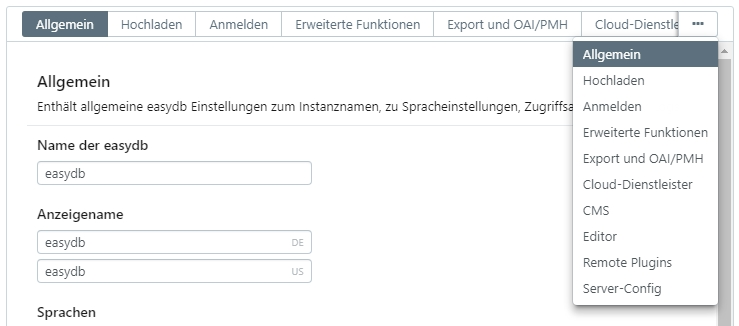

# Basis-Konfiguration

In der Basis-Konfiguration werden globale Einstellungen für easydb vorgenommen. Über die Reiter und das <code class="button">...</code>-Menü können die Einstellungsbereiche aufgerufen werden.

Das Kapitel enthält Erläuterungen und zu den Themen:

* [Allgemein](general)
* [Hochladen](upload)
* [Anmelden](login)
* [Erweiterte Funktionen](extended)
* [Export und OAI/PMH](export)
* [Cloud-Dienstleister](cloud)
* [CMS](cms)
* [Editor](editor)
* [Remote Plugins](plugins)
* [Server-Config](server-config)

## Hochladen/Herunterladen der Basis-Konfiguration 

In der Basis-Konfiguration besteht unten links über den <i class="fa fa-cog"></i>-Button die Möglichkeit die bestehenden Einstellungen der Basis-Konfiguartion herunterzuladen und eine Basis-Konfigurationsdatei hochzuladen (z.B. als Fallback). 

Der Download und Upload der Konfiguration erfolgt über eine JSON-Datei. In der Basis-Konfiguration enthaltene Medien-Dateien (z.B. Logos) werden beim Download oder Upload nicht berücksichtigt.

### Konfigurationsdatei für andere easydb Instanzen erzeugen

Beim Download der Datei sind standardmäßig die IDs hinterlegter Dateien enthalten. Halten Sie beim Download gleichzeigt `ALT` geklickt, um eine von den IDs bereinigte Version der Konfigurationsdatei zu erhalten. Die IDs werden benötigt, wenn Sie die Datei als Backup für ein Produktivsystem speichern. Beim Übertragen der Konfigurationseinstellungen in eine andere easydb ist eine bereinigte Version erforderlich, da Verweise auf Dateien wie Logos und XSLT Sheets in einem anderen System möglicherweise nicht zur Verfügung stehen.
