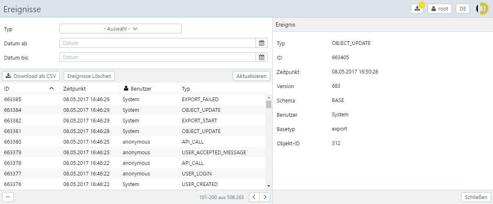

# Events

Here the logs can be displayed in easydb and filtered by type and period. The event log can be downloaded as CSV and deleted completely or selectively.

| Event | Name in front end | Explanation |
|---|---|---|
| api_call | API-Call | Logged when making a call to easydb via API. |
| api_progress | If status information is present in running processes, e.g. When saving records. ||
| asset_download | Asset was downloaded from easydb. ||
| asset_export_download | file download via export An export was carried out and an asset was downloaded from it. ||
| asset_export_transport_copy | File copy over transport | A transport was carried out. The copy of an asset was sent. |
| asset_export_transport_copy_scheduled | File copy over transport with schedule | A transport with timetable was carried out. The copy of an asset was sent. |
| asset_export_transport_download | Download via transport | A transport was carried out and an asset was downloaded. |
| base_config_update | Updating the basic configuration | The basic configuration has been updated. |
| collection_owner_rights_error | An operation for folders failed because it was not consistent with the rights settings. ||
| detail_view | An asset has been called up in the detail view||
| download_export | An export was performed and downloaded. ||
| email_sent | Email Delivery | An email has been sent. |
| export_asset | File Export | An asset has been downloaded. |
| export_failed | Export failed An export failed. ||
| export_finish | An export has been completed. ||
| export_insert | Export created An export has been created. ||
| export_object | Information for Export | Generated when a record is exported. |
| export_start | Export started An export has been started. ||
| export_stopped | Export suspended An export was stopped. ||
| export_update | Export updated | An export has been updated. |
| frontend_error | Frontend errors | There was a frontend error during an operation. |
| login_failed | Login failed A login attempt failed. ||
| object_deleted | record deleted A record has been deleted. ||
| object_index | A record has been indexed, ||
| object_insert | A record has been created. ||
| object_update | Record updated A record has been updated. ||
| resource_not_available | Resource not available For example, When a non-existent URL is called or resources to which the rights are missing. ||
| schema_commit | Data Model Update | The data model has been updated. |
| search | A search request has been sent. ||
| server_shutdown | Server-Stop | The server is paused. |
| server_start | The server has started. ||
| session_invalid | Session invalid An attempt was made to work with a session that was already invalid. ||
| user_accepted_message | Communication accepted Generated when a message is sent that requires confirmation. ||
|user_login | A user has registered. ||
| user_logout | user logout | A user has logged out |
| wordpress_sync | Wordpress synchronization | Copy assets from easydb to Wordpress |
| falconio_sync | Falconio synchronization | Copy assets from easydb to Falcon.io |
