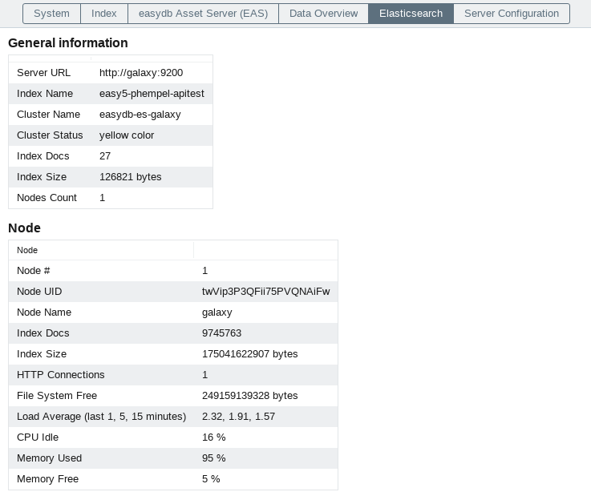

# Server-Status

## Funktionen

Unten rechts befinden sich hinter einem Zahnrad verborgen, folgende Optionen:

| Funktion                   | Beschreibung                                                 |
| -------------------------- | ------------------------------------------------------------ |
| Datenbank & Schema löschen | Dies löscht sowohl alle Datenbank-Inhalte sowie das Datenmodell. Die easydb wird auf den Auslieferungszustand zurückgesetzt. |
| Datenbank löschen          | Dies löscht alle Datenbankinhalte.                           |
| Reindex                    | Dies löscht den aktuellen Elasticsearch-Index und erstellt ihn neu. |
| Server neu starten         | Dies startet den easydb-server neu.                          |

> Hinweis: Die beiden ersten Funktionen sind mit Datenverlust verbunden. Führen Sie diese Aktionen nur durch, wenn sich darüber bewusst sind. Standardmäßig sind diese Funktionen deaktiviert und müssen zunächst über die YML-Konfiguration freigeschaltet werden.

## System

### Allgemeine Information

- Uptime
- API-Version
- Software-Version
- OS-Version

### Anzahl CPUs

- Logische CPUs
- Physische CPUs

### CPU Nutzung

Übersicht über die CPU-Nutzung und -zeiten für `user` und `system`, sowie den Leerlauf (`idle`) der CPUs

### Arbeitsspeicher (RAM)

Übersicht über die Arbeitsspeichernutzung des Systems

- Gesamter Speicher
- Genutzter Speicher
- Verfügbarer Speicher
- Freier Speicher
- Aktiver Speicher
- Inaktiver Speicher
- Speicher im Cache
- Geteilter Speicher
- Auslastung

### Swapspeicher

Übersicht über die Swapspeichernutzung des Systems

- Gesamter Speicher
- Genutzter Speicher
- Freier Speicher
- Auslastung

### Partitionen und Festplattenspeicher

Übersicht über die Partitionen und die Festplattennutzung des Systems

## Index

Übersicht über Prozesse und aktuelle Jobs des Index.

## easydb AssetServer (EAS)

Übersicht über den Status des Asset-Servers.

### Hinweise:

#### Supervisor Versionsstatus

- `new`: Anzahl der Assets, für die Berechnung der Versionen noch aussteht
- `changed`: Anzahl der Assets, für die neu hinzugekommene Berechnungen der Versionen noch ausstehen
- `current`: Anzahl der Assets, für die aktuell alle Versionen berechnet wurden

#### EAS-Jobs:

- `recent-*`: "recent" steht für den Zeitraum innerhalb der letzten 24 Stunden
- `time-per-job`: durchschnittliche Berechnungsdauer pro Asset in Sekunden. Basierend auf der Anzahl der Assets, die innerhalb der letzten 24 Stunden berechnet wurden (`recent-done`). Dieser Wert kann durch das 24-Stunden-Zeitfenster verfälscht werden, wenn die gesamte Berechnung einer großen Menge an Assets vor weniger als 24 Stunden gestartet wurde.

## Datenübersicht

### Objekttypen

Liste der Objekttypen, sowie der Anzahl der Objekte vom jeweiligen Objekttyp. Absteigend nach der Anzahl sortiert.

### Assets

Liste der Assets im System. Gruppiert nach Dateiklasse, MIME Typ und Erweiterung. Absteigend nach der Anzahl der Assets in der jeweiligen Gruppe sortiert.

### Sprachen

Liste der konfigurierten Datenbanksprachen, Frontendsprachen und Sprachen für die Autovervollständigung (Suggest), die aktuell in der [Basiskonfiguration](../base-config/general/#sprachen) aktiviert sind.

### Verlauf von Anmeldungen und Suchanfragen

Akkumulierte Anzahl von Anmeldungen (login events) und Suchanfragen (search events) über die Zeiträume innerhalb der letzten Stunde, der letzten 24 Stunden, der letzten Woche und des letzten Monats. In diesen Zeiträumen sind ebenfalls alle Events aller jeweils kleineren Zeiträume enthalten.

> Diese Events können nur angezeigt werden, wenn die Eventtypen in der [Basiskonfiguration](../base-config/event_logging/#benutzer-aktivität-loggen) aktiviert wurden!

## Elasticsearch

Übersicht über allgemeine Informationen zum Status der Elasticsearch, wie Server-URL, Indexname, Cluster-Name, Cluster-Status und Verbindungsfehler.

## Server-Konfiguration

Diese Übersicht zeigt die gesamte [System-Konfiguration](../../../sysadmin/konfiguration/easydb-server.yml/). Die Übersicht wird nach den Unterknoten von `system` gruppiert.
