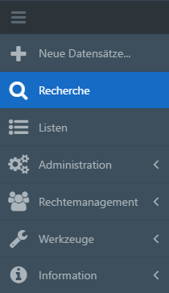

# Datenverwaltung

Die Datenverwaltung umfasst das Anlegen, Suchen, Verändern und Löschen von Datensätzen in easydb. Der Bereich beinhaltet folgende Menüpunkte:

|Datenverwaltung|Erläuterung|
|---|---|
|Neue Datensätze...|Neue Datensätze werden über den Menüpunkt [Neu...](new_objects) in easydb angelegt. Ebenfalls können Dateien einfach per Drag & Drop z.B. vom Desktop in easydb gezogen werden. Markieren Sie die gewünschten Dateien auf Ihrem Desktop mit der linken Maustaste und ziehen Sie diese in easydb rüber. Beim Fallenlassen öffnet sich automatisch der Dialog *Neue Datensätze*.|
|Recherche|Datensätze, die als Haupt-Objekttypen (z.B. *Bilder*) angelegt sind, können in [Recherche](search) gesucht, verändert, gelöscht und in [Mappen](search/quickaccess/collection) verwaltet werden. Mappen dienen dazu eine Auswahl von Datensätze zu sammeln, (gruppiert) zu bearbeiten oder anderen Nutzern freizugeben. Neben-Objekttypen (z.B. *Fotografen*, *Kategorien*, *Schlagworte* etc.) sind Datensätze, die Haupt-Objekttypen deskriptiv ergänzen und an diese angehängt werden können.|
|Listen|In [Listen](lists) können Haupt- und Neben-Objekttypen (z.B. *Fotografen*) eigenständig gesucht, verändert und gelöscht werden.|

Details zu Datei-Versionen, Datentypen und Masken sind in entsprechenden eigenen Kapiteln ausführlich erläutert.

* [Datei-Versionen](search/assetversions)
* [Datentypen](features/datatypes)
* [Masken](features/masks)
