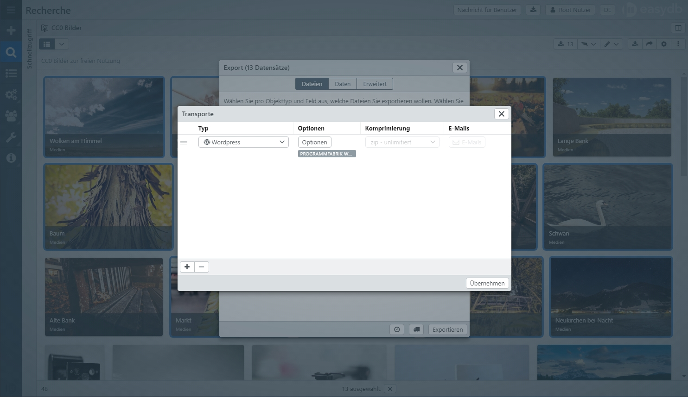
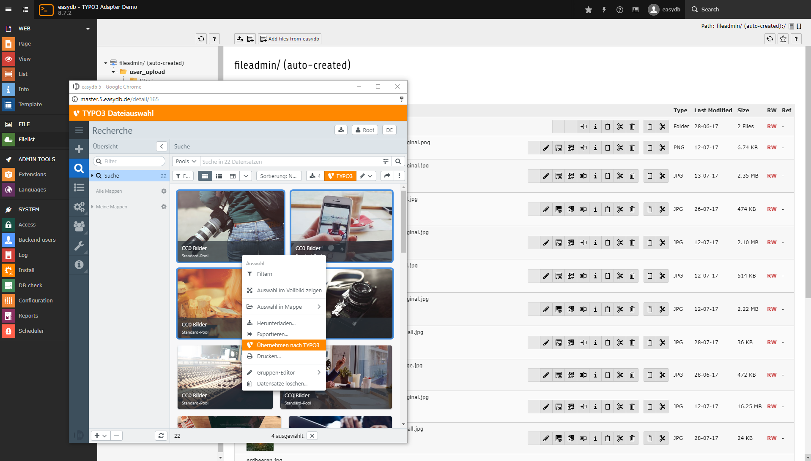
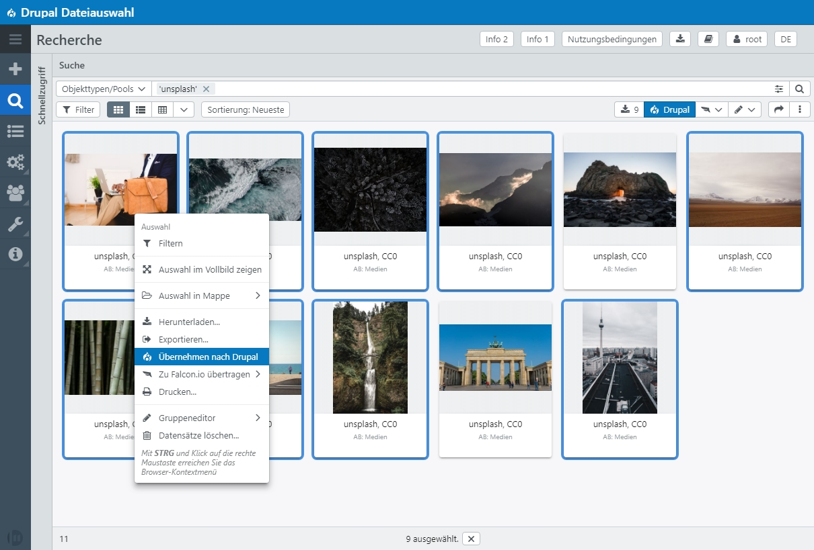

# CMS Plugins

easydb verfügt über offene Schnittstellen und kann über Plugins erweitert werden. Hierbei können bestehende Plugins genutzt werden oder eigene Plugins zu easydb hinzugefügt werden.

Frei verfügbare open source Plugins sind über das [Github](https://github.com/programmfabrik) Repository der Programmfabrik zu finden. 

Kostenpflichtige Plugins werden durch Bestellung von Programmfabrik ausgeliefert. Einige der bereitstehenden Plugins für CMS-Anbindungen bestehen dabei aus 2 Komponenten. 

|CMS|	Plugin für easydb	| Plugin für CMS|
|---|---|---|
|Wordpress|	Ja, kostenpflichtig	|nein|
|TYPO3|Ja, kostenpflichtig	|Ja, open source auf github|
|Drupal|Ja, kostenpflichtig	|Ja, open source auf github|
|Falcon.io|	Ja, kostenpflichtig	|nein|

## Wordpress {#wordpress}

Mit diesem easydb Plugin können Mediendateien ins Wordpress CMS transferiert werden. In Wordpress erscheinen sie in der Mediengalerie und können von dort wie gewohnt verwendet werden. Mediendateien können aus easydb gesendet und Aktualisierungen synchronisiert werden. Eine Unterstützung für das Löschen von Medien existiert nicht. 

Die Installation zur Aktivierung des Wordpress-Plugins in easydb erfolgt in 3 Schritten:

1. Das Wordpress [Plugin installieren](/en/sysadmin/installation/plugin)

2. Zugriff auf Wordpress in der [Basis-Konfiguration](/de/webfrontend/administration/base-config/cms) einrichten.

3. Berechtigten Benutzern oder Gruppen das [Systemrechte](/de/webfrontend/rightsmanagement) **Wordpress Export erlauben** für die Nutzung des Plugins zuweisen.

Nach erfolgreicher Installation und Konfiguration können Benutzer über den [Exporter](../../features/export) einen [Wordpress-Transport](../../features/export) anlegen. Aktuell wird nur der Versand von Bildformaten unterstützt. 

Bei Änderungen am Datensatz in easydb gilt Folgendes für Wordpress:

|Änderung in easydb|Beispiel|Veränderung in Wordpress|
|---|---|---|
|Löschen eines Datensatzes||Bilddatei bleibt in Wordpress erhalten.|
|Datei verändern|durch Zuschneiden|Bilddatei wird beim Transport in Wordpress neu angelegt. |
|Metadaten am Datensatz ändern| Titel ändern und durch Ersetzung als neuen Dateinamen für Export verwenden. | Beim Transport bleibt die existierende Datei in Wordpress erhalten. Der Name der Datei wird aktualisiert.|
|Änderung am Benutzer|durch Änderung des Namen|Bilddatei bleibt in Wordpress davon unberührt.|

## TYPO3 {#typo3}

Über ein easydb-Plugin für TYPO3 (ab Version 7) können Datensätze aus easydb zu TYPO3 gesendet werden. Hierbei können neben den Dateien auch ausgewählte, mehrsprachige Metadaten übermittelt werden. Die Dateien erscheinen dort in der Filelist und können dann wie gewohnt verwendet werden.

Das Plugin ist zweiteilig und wird in easydb und in TYPO3 installiert. 

Das ausgelieferte Plugin für easydb muss von einem Systemadministrator in einer YAML-Datei installiert und aktiviert werden, siehe [Plugin-Installation](/en/sysadmin/installation/plugin). Notwendige Einstellungen müssen anschließend in der [Basis-Konfiguration](/de/webfrontend/administration/base-config/cms) vorgenommen werden.

Das Plugin für die Einrichtung in TYPO3 steht mit einer Installationsanleitung über [GitHub](https://github.com/programmfabrik/typo3-easydb-plugin) bereit.

Nach der Installation erscheint oberhalb der Filelist ein Button, der die easydb in einem neuen Fenster öffnet. Hier können die Datensätze ausgewählt werden, die zu TYPO3 gesendet werden sollen. Über die Toolbar und das Kontextmenü steht die Option "Übernehmen nach TYPO3" zur Verfügung.

Geänderte oder gelöschte Datensätze in easydb werden nicht mit TYPO3 synchronisiert. Änderungen am Datensatz müssen in TYPO3 manuell überführt werden.

## Drupal {#drupal}

Nach erfolgreicher Installation [Plugin-Installation](/en/sysadmin/installation/plugin) und Konfiguration in der [Basis-Konfiguration](/de/webfrontend/administration/base-config/cms), können Dateien aus easydb zu Drupal gesendet werden.

Mit dem easydb Plugin werden Mediendateien an das Drupal CMS transferiert. In Drupal erscheinen sie in der Mediengalerie und können von dort wie gewohnt verwendet werden. Mediendateien können aus easydb gesendet und Aktualisierungen synchronisiert werden. Eine Unterstützung für das Löschen von Medien existiert nicht. Unterstützt werden aktuell nur Bildformate.

## Falcon.io {#falconio}

Über ein Plugin für falcon.io können Datensätze aus easydb zu falco.io gesendet werden. Das ausgelieferte Plugin für easydb muss von einem Systemadministrator installiert und aktiviert werden, siehe dafür [Plugin-Installation](/en/sysadmin/installation/plugin). Nach der Installation des Plugins können eine oder mehrere Falcon.io Instanzen in der easydb [Basis-Konfiguration](/de/webfrontend/administration/base-config/cms) angelegt werden.

Datensätze können nach erfolgreicher Installation von easydb nach Falcon.io exportiert werden. In Falcon.io erscheinen sie im Content-Pool und können von dort wie gewohnt verwendet werden.
Ein Falcon.io-Transport kann aus dem easydb Asset-Browser oder aus der Listenansicht gesendet werden. Wenn das Falcon.io-Plugin aktiv ist, klicken Sie einfach mit der rechten Maustaste auf einen Datensatz oder mehrere Datensätze und wählen Sie "An Falcon.io senden".

