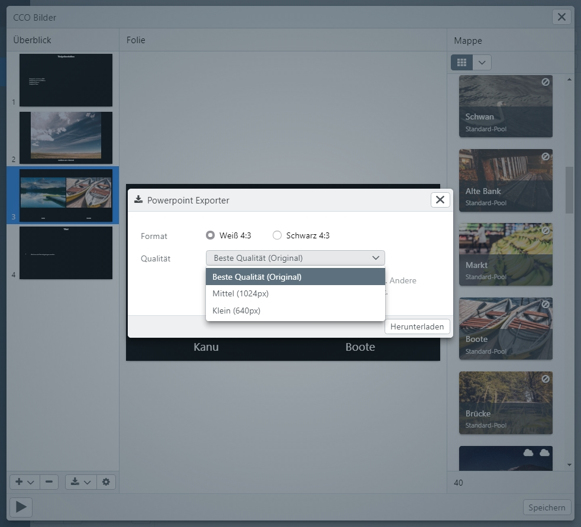

# Presentations

Easydb provides the functions to create presentations for folders. Pro [Collection](../../search/quickaccess/collection), a presentation can be created, stored for the folder and also exported.

Saved presentations for folders are displayed in the [Quick Access](../../search/quickaccess) folder by clicking on the button in the presentation mode to be started. To open the presentation, open the presentation using the context menu.

## Create a presentation

When this feature is set up, presentations can be created by using the context menu. 
* When openning a presentation, an overview of the slides appears on the left. The first slide (title slide) is preset and can not be removed within easydb.
* Additional slides can be added with <code class="button">+</code> via the options menu at the bottom. A selected slide can be removed with <code class="button">-</code>. 
* The collection name automatically appears as title. The title can be changed manually.
* The current slide is displayed in the middle. 
* The content of the collection is available on the right side and can be dragged and dropped into the slides in the middle. 
* If a record cotains several images, a selection bar appears at the bottom of the image after drag & drop into the slide. Use the arrows to select the desired image. The pptx-export-file contains the selected image.

|Button|Option|Description|
|---|---|---|
|<i class="fa fa-plus"></i><i class="fa fa-angle-down"></i>||Selection menu for adding new slides
|| Free text | Creates a slide for entering a text with title |
|| A record | slide for a record. The data set can be dragged into the slide from the overview for the folder on the right-hand side. With <i class="fa fa-trash-o"></i> The record can be removed from the slide again |
|| Two records | Slide for two juxtaposed records. The records can be dragged into the slide from the overview for the folder on the right-hand side. With <i class="fa fa-trash-o"></i> The records can be removed from the slide
|| All missing ... | Inserts all unused records of the folder into slides. A slide is generated per record. |
|<i class="fa fa-minus"></i>||Delete selected slide from overview. |
|<i class="fa fa-search-plus"></i><i class="fa fa-search-minus"></i>|Zoom |For slides with records, a zoomer is available. It is activated by turning the mouse wheel (zoom-in). The data record can be zoomed into detail or displayed as a full image. The selection in the small view window can be positioned with drag & drop in the image to select the zoomed section. |
||Double Projection | To change the order of records in double projections (slide with two records), the records must be removed and reinserted in the new order|
|| Order | The order of the slides can be changed by means of drag & drop. Only the position of the title sheet can not be changed.|
|<i class="fa fa-cog"></i>|| For slides with records, a subtitle can be added from the record. For "Standard", the infomation is taken from the data set, which was defined as the default for the object type.|
|<i class="fa fa-play"></i>|| Starts presentation mode in full screen. You can navigate through the slides using the mouse or the arrow keys on the keyboard. |

## Export the presentation

You can export your presentations from easydb in the format pptx for Powerpoint. The format and quality for the export can be selected in the selection dialog.

> NOTE: A presentation will be deleted when the collection is deleted.
