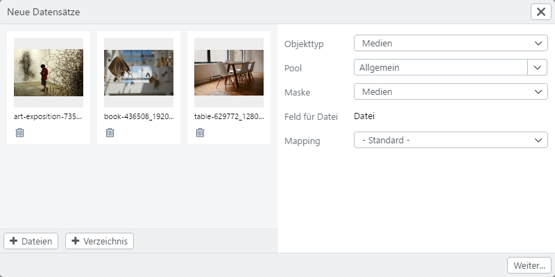
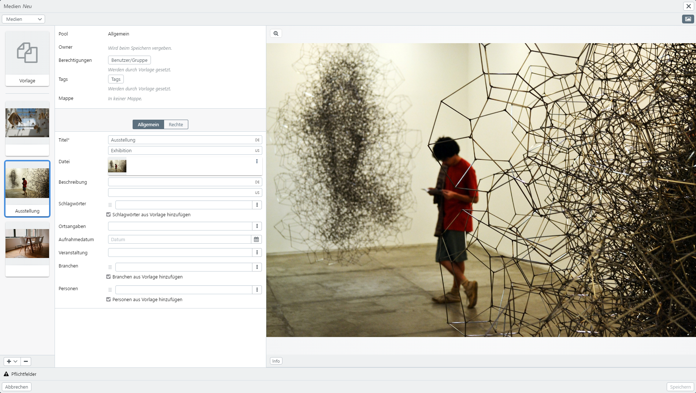
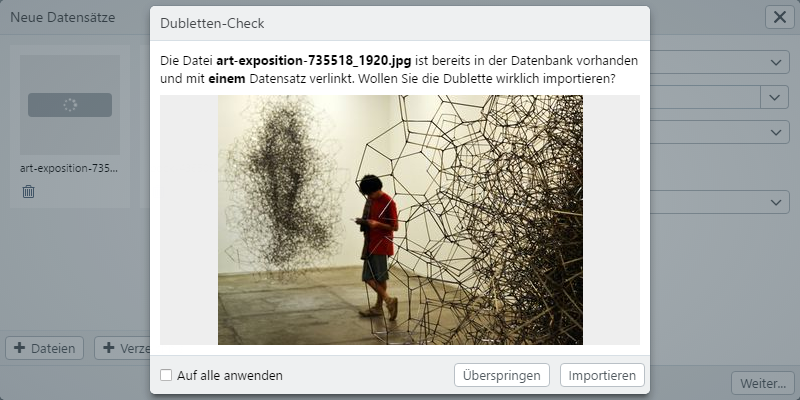

# New records

## Create new records

To get records for main object types into the easydb, you can simply open this dialog from your desktop using drag & drop. Alternatively, go to the main menu here.

| Setting | Note |
|---|---|
| Object Type | The object type for which the new records are created. Here are only the main object types listed. If you hold down the ALT key and then click on the pulldown, all object types appear with additional information|
| Pool | Select the pool in which the records are to be created. The selection of the pool determines the choice of the*mask*and the*field*|
| Mask | Mask to be used for editing. In accordance with the settings in the management of the rights, you will see one or more masks here|
| File by File | If you want to upload files, specify the field for which the files are intended. Note that in this step, files can only be assigned to one field at a time. So if you want to upload two files for a record (for example, *front* and *back*), you can do this only in the editor|
| Pool for linked objects | This option is only displayed if you store your files in a separate object type with activated pool management and refer to this object type. This is the case, for example, when you separate collection object information and image information. The image data records can thus be stored in a different pool. |
| Mapping | Select a mapping to add metadata from the files to the input form. |

In the large area there is the possibility to upload further files with <code class="button">+ files</code> and<code class="button"> + directory</code>. <code class="button">+ Directory</code> is currently only offered in*Google Chrome*and*Apple Safari*. You can also drag additional files into this area by drag & drop.

An upload status is shown at the bottom left. You can abort the upload by clicking "Cancel".

Click <code class="button">Next ...</code> to open the editor.

## New records editor

On the left you will see the list of the new data sets that are created when you click on <code class="button">Save</code>. At the top there is *Template*. The entries here refer to all data records that you create.

You can click *Template* or another record to fill the fields in the editor with the corresponding data. Data set by default appears as placeholders in the input fields of the actual data set. Here, you can specify different data by selecting the individual data records.

Use the menu at the bottom left to load more records into the editor. You can upload files or directories, or create empty records.

The selected record can be removed from the menu at the bottom left with <i class="fa fa-minus"></i>.

On the right side of the screen, you will see the *file preview* with zoom enabled.

At the top right, there is a pull-down to switch to another mask when multiple masks are available.

After the input, the process can be terminated with <code class="button">Save</code>. If there is a required field, this must be completed before the operation can be saved. If the required field is multilingual, only one of the fields must be filled to complete the process.

More information on the editor can be found in the corresponding chapter [Editor](../search/editor).

## Duplicate check

When uploading new records, easydb checks whether the record is already included. You can then decide whether you want this record <code class="button">skip</code> or<code class="button"> import</code>.

If the duplicate is deleted, it is removed from the upload process and the upload process continues with the remaining records, if multiple records have been selected.

If you agree with <code class="button">Import</code> to accept the duplicate, you can proceed with the creation of the data record as usual.

The duplicate note appears for each duplicate record individually. The check box "Apply to all" allows the process to be transferred once to all duplicates that are in the current upload process.

Technically, the duplicate check is performed by calculating a test value (MD5 hash), which also includes the IPTC, XMP and EXIF ​​metadata contained in images, for example.

## Serial images and versions {#batch}

When uploading records to easydb, serial images and versions can be created in the editor for new records.

If the object type option is configured, you can specify in `Field for files` how the uploaded records and related files / records are placed in easydb.

If **Detect versions** is active for the upload, files that have the same file name and differ only in the file extension are recognized as versions in easydb (e.g. `foto.jpg` and `foto.png`).

The first file is created as an original, all subsequent files are created as versions. This can be changed again in the template for the record by calling the versions in the field for the file and moving them manually.

If **Detect series** is activated for the upload, they are recognized by the file name and automatically assigned to a record, if the data model provides the option to store several files for an object type. This option is only enabled if an asset field in a nested table or in a reverse nested object is selected for `Field for files`.

The distinction is made by the notation `"_"` (underscore), `" "` (space) or `"-"` (hyphen), followed by a number and the file extension (e.g. `file-1.jpg`, `file-2.jpg` or `bild_1.png`, `bild_2.png`).

Please note that from the group of files `image.jpg`, `image_01.jpg`, `image_02.jpg`, only `image_01.jpg` and `image_02.jpg` will be detected as a series of files, while `image.jpg` will not be detected as part of the series but a different object.

> NOTE: If **versions** are deactivated and **series** are active, files with identical names that differ only in the file extension are also recognized as series. If both are active, this type of file notation is recognized as a version as described above.
