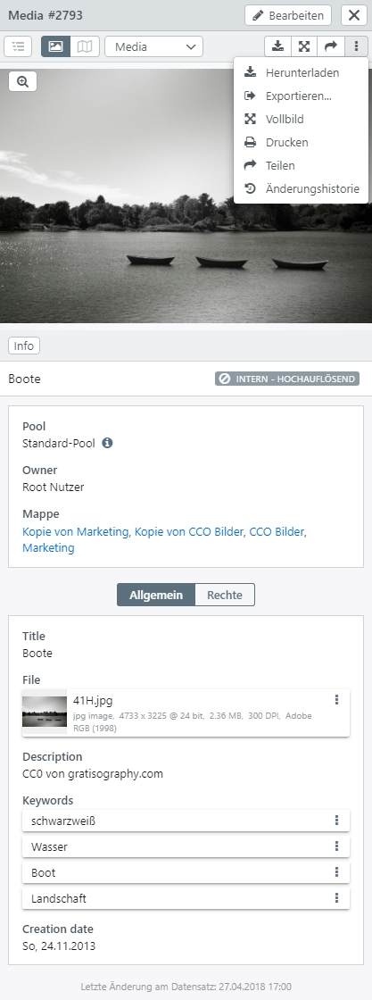
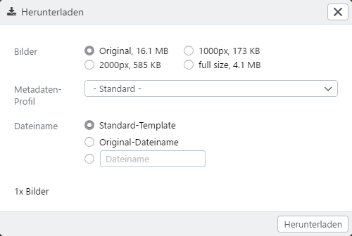
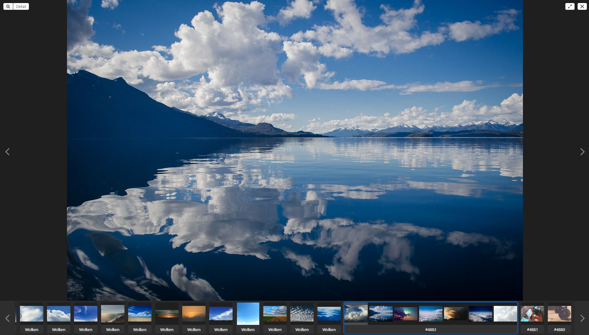
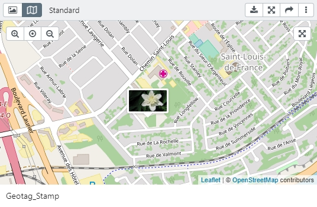

# Detailansicht

Die Detailansicht für einen Datensatz erscheint wahlweise rechts in der Sidebar oder im Vollbild.

## Sidebar {#sidebar}

In der Sidebar erscheint im oberen Bereich die [Dateivorschau](../../features/datatypes), die Sie mit <i class="fa fa-image"></i> ein- und ausschalten können. Diese Einstellung wird in Ihrem Benutzerprofil gespeichert. Unter der Dateivorschau wird ein Info-Button angezeigt, über den alle XMP-/EXIF-/IPTC-Metadaten der Datei eingesehen werden können (dieser Button ist über das Systemrecht "[Detailansicht für Metadaten](../../../rightsmanagement)" geschützt).

|Button|Erläuterung|
|---|---|
|<i class="fa fa-pencil"></i><code class="button">Bearbeiten</code>|Erscheint, wenn das Recht zur Bearbeitung des Datensatzes besteht. Wechsel von der Detailansicht zum Editor in der Sidebar.|
|<i class="fa fa-times"></i>|Schließt die Detailansicht in der Sidebar.|
|| Erscheint bei hierarchischen Objekttypen und blendet neben der Detailansicht den Hierarchiebaum ein und aus. |
|<i class="fa fa-image"></i>|Blendet die Vorschau der Datei ein oder aus.|
|<i class="fa fa-map-o"></i>|Wenn die Datei(en) Geokoordinaten enthalten, werden diese in einer Karte dargestellt. Kartenansichten sind in easydb als Plugin standardmäßig eingebunden und können über die [Basis-Konfiguration](../../../administration/base-config/extended) aktiviert werden.|
|<code class="button">Maske</code>| Stehen für den Datensatz mehrere Masken zur Verfügung, erscheint dieses Feld für berechtigte Benutzer als Auswahlfeld. Andernfalls ist hier nur der Name der Maske zu sehen, ohne dass diese geändert werden kann. Dies ist auch der Fall, wenn generell nur nur eine Maske zur Verfügung steht. |
|<i class="fa fa-download"></i>|Öffnet für den Download der Datei einen Auswahl-Dialog. Je nach Konfiguration stehen verschiedene Größen, Mappings und die Möglichkeit zur Vergabe eines Dateinamens zur Auswahl (siehe unten).|
|<i class="fa fa-sign-out"></i>|Öffnet für den [Export des Datensatzes](../../features/export) einen Auswahl-Dialog. Über die Reiter im Dialog können unterschiedliche Einstellungen zur Datei, zu den Metadaten und zum Export selbst vorgenommen werden.|
|<i class="fa fa-arrows-alt"></i>|Öffnet den Datensatz im Vollbild.|
|<i class="fa fa-print"></i> Drucken...|Im Optionen-Menü verfügbar. Öffnet den Drucken-Dialog für den Datensatz. Für den Druck kann die Detailansicht oder die Text-Ansicht und eine hohe oder niedrige Auflösung gewählt werden.  |
|<i class="fa fa-share"></i> Teilen|Erzeugt einen Link zum Datensatz, der an berechtigte Benutzer weitergegeben werden kann.   *Hinweis: Wird beim Klick auf den Teilen-Button gleichzeitig `SHIFT` oder `Alt` gedrückt, wird für die Deep-Link-Url zu /api/objects eine Url mit der aktuellen Session erzeugt. Damit können zu Testzwecken Datensätze erreicht werden, die für den Deep-Link-User nicht oder noch nicht freigegeben sind.*|
|<i class="fa fa-history"></i> Änderungshistorie|Nutzern mit entsprechendem Systemrecht (siehe [Systemrechte](/de/webfrontend/rightsmanagement)) wird eine Zeile für die Anzeige der Änderungshistorie eingeblendet. Die Änderungen werden chronologisch mit Zeit und Datum, Art der Änderung und dem Bearbeiter angezeigt. |
|Letzte Änderung | Ein Hinweis am unteren Rand der Felder zeigt an, wann der Datensatz zuletzt geändert wurde. |

### Herunterladen {#download}

Wählen Sie für das zu herunterzuladende Datei-Feld eine Größe des Downloads aus. Wählen Sie eine Option für den Export des Metadatenprofils und für den Dateinamen. Es kann auch ein eigener Dateiname eingetragen werden. Hierfür können die Ersetzungen verwendet werden, die auch für den jeweiligen Objekttypen unter [*Dateinamen für Export und Download*](../../../rightsmanagement/objecttypes) zur Verfügung stehen.

Der Download erfolgt als ZIP-Datei. 

easydb unterstützt den Download verschiedener Dateigrößen (Varianten). [Eigene Varianten](/de/sysadmin/konfiguration/produce) können von einem Systemadministrator über eine .yml-Datei konfiguriert werden.

## Vollbild

In der Vollbildansicht können Listen durchgeblättert werden. Am unteren Rand wird eine Übersicht mit Vorschaubildern angezeigt. Oben links können Sie mit <code class="button">Detail</code> weitere Informationen zum Datensatz anschauen, mit <i class="fa fa-expand"> </i> können Sie das Vollbild auf den ganzen Bildschirm vergrößern und mit <i class="fa fa-times"> </i> schließen Sie die Vollbildansicht. Über <i class="fa fa-search-plus"> </i> oben links wird der Zoomer aktiviert, um Details vergrößert anzuzeigen.

Mit <i class="fa fa-chevron-left"> </i> und <i class="fa fa-chevron-right"> </i> neben dem angezeigten Datensatz kann zum nächsten Datensatz geblättert werden. Die Vorschauleiste kann über die entsprechenden Symbole am Rand nach links und rechts bewegt werden. Datensätze, in denen andere Assets verlinkt sind, werden wie im Screenshot gruppiert durch eine Umrandung angezeigt.

> HINWEIS: Wenn das Vollbild Icon in der Vollbildansicht sowohl im Asset Browser als auch im Asset Detail grau ( = deaktiviert) ist, dann hat der Nutzer bei seinem Browser den Vollbildmodus nicht aktiviert.

## Teilen

Über <i class="fa fa-share"></i> oben in der Datailansicht können Sie den Datensatz oder aus dem entsprechenden Feld die Datei, die mit dem Datensatz verknüpft ist, teilen. Nähere Informationen zum Teilen und Freigeben über Links finden sie im Kapitel [Deep Links](/de/webfrontend/datamanagement/features/deeplinks).

## Hierarchische Objekttypen

## Anzeige in einer Karte {#geotag}

Für Dateien, die Geokoordinaten in den Metadaten enthalten, erscheint in der Detailansicht die Option zur Darstellung in einer Karte. Neben dem Button zum ein- und ausblenden der Dateivorschau befindet sich ein Button mit einer Karte. Mit den Buttons kann zwischen den Ansichten gewechselt werden. Die Vorschau der Datei wird durch ein kleines Thumbnail auf der eingebundenen [OpenStreetMap](http://www.openstreetmap.org) dargestellt. 

Die Geodaten müssen in der Datei enthalten sein. Die Darstellung in Karten greift nicht, wenn die Geodaten lediglich in die Metadaten des Datensatzes geschrieben werden. 

Die Anzeige von Geotags in Karten ist ein Plugin für easydb, dass standardmäßig ausgeliefert wird (inkl. YML-config). In der [Basis-Konfiguration](/de/webfrontend/administration/base-config) kann es im Reiter Design über eine Checkbox global aktiviert werden. Am Objekttyp können die Karten individuell je Maske aktiviert und deaktiviert werden.

