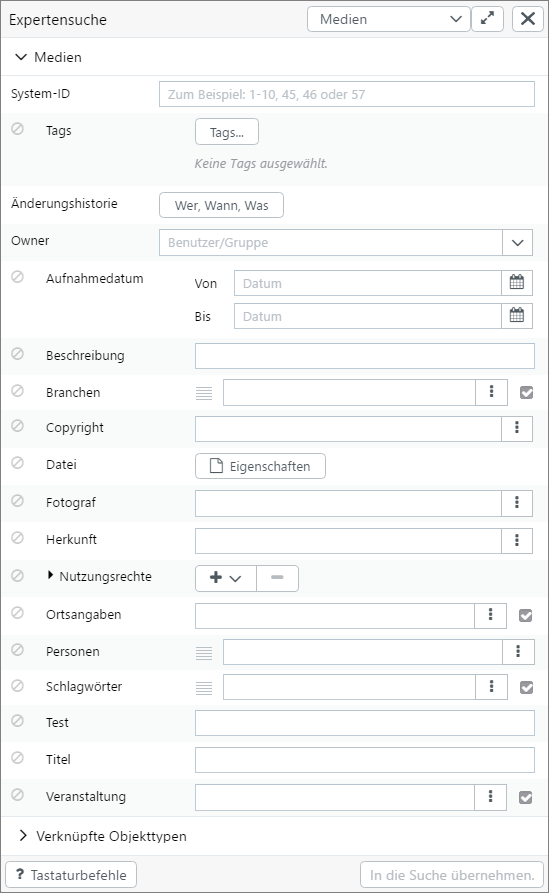
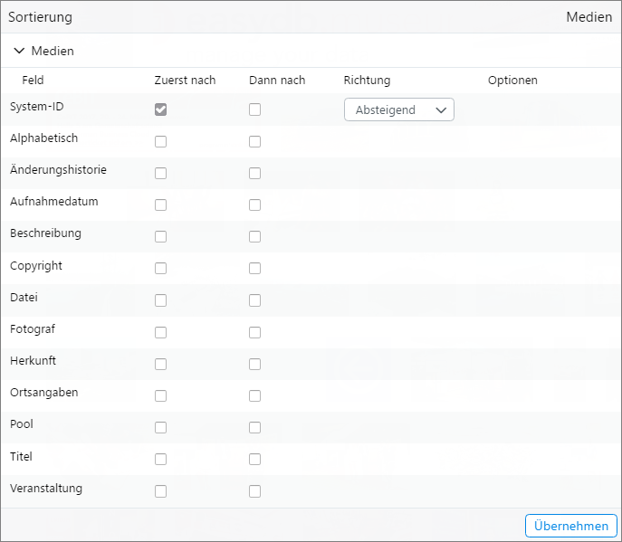
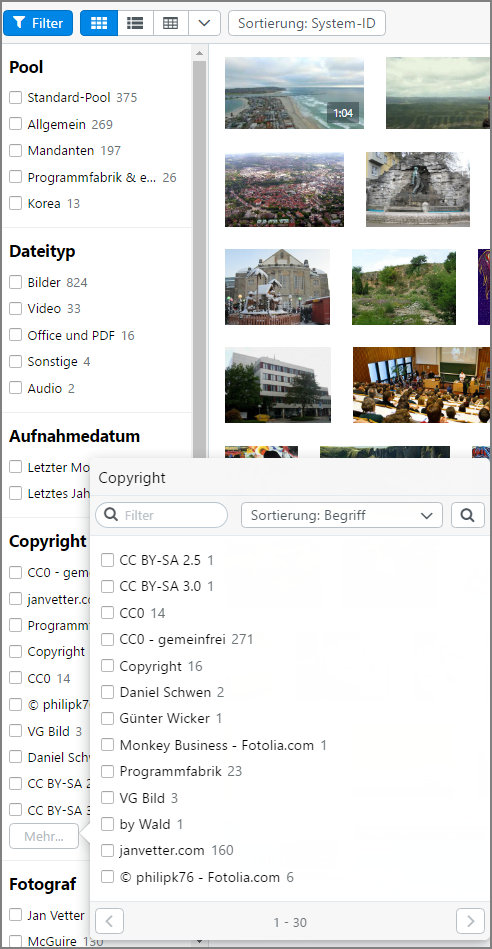
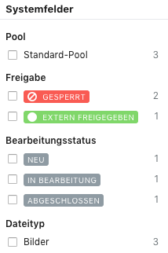

# Suche

Die Hauptsuche erreichen Sie über den Menüpunkt Recherche. Dies ist standardmäßig auch die Ansicht nach dem Benutzer-Login.

## Automatische Vervollständigung

Wenn Sie anfangen Ihre Sucheingabe in das Suchfeld einzugeben, werden Vorschläge basierend auf dem eingegebenen Wort oder Worten generiert. easydb sucht dabei nach passenden Wörtern und auch nach passenden verlinkten Datensätzen.

Sie können ein gefundenes *Token* oder einen verlinkten Datensatz auswählen (Cursor-hoch/runter + Return oder Maus). Der ausgewählte Eintrag erzeugt dann einen Suchbegriff im Suchfeld. Es können mehrere Suchbegriffe hinzugefügt und mit Befehlen (Suchoperatoren) kombiniert werden.

## Und/Oder-Verknüpfungen

Um eine Kombination von Suchbegriffen zu erzeugen, können mithilfe der Booleschen Logik folgende Einträge über Tastenkombinationen eingegeben werden:

|Taste|Such-Operator|Erläuterung|
|---|---|---|
|<code class="button">-</code>|<code class="token">NOT</code>|Der nachfolgende Suchbegriff wird mit "Nicht" gesucht.|
|<code class="button">+</code>|<code class="token">AND</code>|Der nachfolgende Suchbegriff wird mit "Und" verbunden.|
|<code class="button">,</code>|<code class="token">OR</code>|Der nachfolgende Suchbegriff wird mit "Oder" verbunden.|
|<code class="button">(</code>|<code class="token">(</code>|Klammer für logische Zusammenhänge.|
|<code class="button">)</code>|<code class="token">)</code>|Klammer für logische Zusammenhänge.|

>Benutzen Sie die Tastatur, um mit Cursor links und Cursor rechts die Suchbegriffe zu durchlaufen. Benutzen Sie <code class="button">Backspace</code> oder <code class="button">Delete</code>, um einen Suchbegriff zu löschen. Suchbegriffe können nicht geändert werden, Sie können sie nur löschen und wieder neu eingeben.

## Objekttypen/Pools

Die Suche läuft standardmäßig über alle Pools und Objekttypen in denen sich Datensätze befinden, die Sie mindestens Lesen dürfen. Klicken Sie auf <code class="button">Objekttypen/Pools</code>, um diesen Such-Filter anzupassen.

Benutzen Sie die Checkboxen um einzelne Objekttypen oder Pools zu wählen oder abzuwählen. Halten Sie <code class="button">Alt</code> gedrückt um alle Checkboxen einer Ebene auf einmal umzuschalten.

Klicken Sie auf das <i class="fa fa-info"></i>, um Informationen zu dem Objekttyp oder Pool zu erhalten. Es werden hier Ansprechpartner und ggfs. eine Beschreibung angezeigt.

## Expertensuche {#expert}

Um komplexere Filter für die Suche zu definieren klicken Sie auf <i class="fa fa-sliders"></i> rechts im Suchfeld. Durch die Eingabe von Begriffen in die Suchfelder können Sie die Suche für ein oder mehrere Felder definieren. Die Einträge werden als Suchbegriffe in das Suchfeld übernommen.

Sind mehrere Objekttypen definiert, könne Sie über das Pulldown <code class="button">Alle Objekttypen</code>, die Objekttypen für die Suche selektieren. Die Eingaben in den Suchfeldern beschränken sich dann auf den ausgewählten Objekttyp. Wenn Sie mehrere Objekttypen einzeln durchsuchen wollen, müssen Sie mehrfach die Eingabe in der Experten-Suchen für den entsprechenden Objekttyp vornehmen. Ihre Eingaben für unterschiedliche Objekttypen werden bei Übernahme in das Suchfeld gesammelt.

Die Checkbox in der rechten Spalte sucht *Datensätze ohne Eintrag*, d.h. wenn Sie beispielweise bei einem Feld mit Namen *Beschreibung* diese Checkbox anwählen, und dann auch <code class="button">In die Suche übernehmen</code> klicken, filtern Sie alle Datensätze bei denen das Feld *Beschreibung* leer ist.

In **Alle Objekttypen** zeigt die Nebensuche im oberen Teil unter *Verknüpfte Objekttypen* gemeinsame verlinkte Objekttypen und ggfs. den Typ *Datei* der gemeinsam durchsucht werden kann.

In **Gemeinsame Felder** sind die Felder angezeigt, die begrifflich in allen Objekttypen vorkommen. Beachten Sie, dass hier der übersetzte Name zum Vergleich herangezogen wird, nicht der Datenbank-Feldname.

Innerhalb einzelner Objekttypen wird dann in *Gemeinsame Felder* angezeigt, wenn das Feld in mehr als einer Maske vorkommt.

In **Änderungshistorie** kann nach Benutzer, Vorgang, Zeitraum und nach *Kommentar* gesucht werden. Bei der Suche nach *Kommentar* wird geprüft, ob der Kommentar in einem der Datensätze enthalten ist. Ist die Suche auf einen bestimmten Benutzer oder einen beschränkten Zeitraum begrenzt, beziehen sich diese Angaben nicht auf den Entstehungskontext des Kommentars. Die Kommentare in den Treffern können folglich von anderen Benutzern und aus anderen Zeiträumen stammen.

>HINWEIS: Die Sortierung in der Expertensuche ist alphabetisch und bezieht sich auf alle verfügbaren Masken. Sind mehrere Haupt-Objekttypen für die Suche definiert, wind in der Expertensuche ein Auswahlmenü für die Objekttypen angezeigt. Hier kann gewählt werden, ob die Feldlisten standardmäßig (entsprechenden der Anordnung in der Maske) oder alphabetisch in der Expertensuche angezeigt werden.

## Sortierung

Das Suchergebnis kann nach einem Kriterium oder nach zwei Such-Kriterien sortiert werden.

Je nach gewählter Objekttypen/Pool-Auswahl stehen hier verschiedene Felder zur Verfügung. Felder werden nach ihrem lokalisierten Namen zusammengefasst.

Bei einigen Feldern kann neben der Sortierrichtung noch das Sortierattribut ausgewählt werden, so z.B. bei Dateien wo nach *Dateigröße*, *Datei-Klasse* und *Format* sortiert werden kann.

Für einige Datentypen wird bei einer Sortierung auch eine Gruppierung aktiv, die Zwischen-Überschriften im Such-Ergebnis einblendet.

Attribute für ausgewählte Feldtypen:

|Datentyp|Attribut|Erläuterung|
|---|---|---|
|Datei|Dateigröße|Sortiert nach der Dateigröße in Bytes.|
| |Art, Format|Sortiert zuerst nach Datei-Klasse und darin nach dem Format.|
| |Format|Sortiert nur nach dem Format.|
|Changelog|Angelegt|Sortiert nach dem Zeitpunkt wann ein Datensatz angelegt wurde.|
| |Geändert|Sortiert nach dem Zeitpunkt wann ein Datensatz zuletzt geändert wurde.|
|Datums-Bereich|Datum von|Sortiert nach dem *von*-Datum.|
| |Datum bis|Sortiert nach dem *bis*-Datum.|

## Anzeige

Die Anzeige im Suchergebnis schalten Sie mit den Auswahlbuttons über den Treffern  zwischen Standard (Galerie), Textansicht und Tabelle um. Klicken Sie auf <i class="fa fa-angle-down"></i>, um die Anzeigeoptionen für die jeweilige Anzeigeauswahl zu verfeinern.

### Anzeigeoptionen

#### Anzeigeoption *Standard*

|Einstellung|Auswahl|Erläuterung|
|---|---|---|
|Größe|Klein|Kleinste Vorschaugröße|
| |Mittel|Mittlere Vorschaugröße|
| |Groß|Größte Vorschaugröße|
|Format|Füllen|Ausfüllende Vorschau entsprechend des Seitenverhältnisses des Thumbnails |
| |Thumbnail| Vorschau mit vollständigen Thumbnail unter Berücksichtigung des Seitenverhältnisses |
| |Ohne Rand|Ausfüllende Vorschau ohne Berücksichtigung des Seitenverhältnis des Thumbnails (Ausschnitt) |
|Stil|Überlagert|Anzeige zusätzlicher Informationen das Thumbnail überblendent|
| |Unterlegt|Anzeige zusätzlicher Informationen unterhalb des Thumbnails|
| |Seitlich|Anzeige zusätzlicher Informationen neben dem Thumbail|
|Standard Info| Checkbox |Einblendung einer Dateiinformation|
|Objekttyp| Checkbox|Einblendung des Objekttypen als Information|
|Pools| Checkbox|Einblendung des Pools als Information|
|Tags|Checkbox |Einblendung der Tags als Information|
|Treffer je Seite|Dropdown|Auswahl der Menge an Treffern, die pro Seite angezeigt werden sollen.|

#### Anzeigeoption *Text*

|Einstellung|Auswahl|Erläuterung|
|---|---|---|
|Flache Hierarchie| Checkbox| Erscheint, wenn hierarchische Objekttypen eingerichtet sind. Wenn aktiv, werden die Hierarchien aufgelöst und die untergeordneten Typen in der Ansicht auch angezeigt.|
|Treffer je Seite|Dropdown|Auswahl der Menge an Treffern, die pro Seite angezeigt werden.|

#### Anzeigeoption *Tabelle*

|Einstellung|Auswahl|Erläuterung|
|---|---|---|
|Größe|Klein|Kleinste Vorschaugröße|
| |Mittel|Mittlere Vorschaugröße|
| |Groß|Größte Vorschaugröße|
|Anzeige in erster Spalte|Nicht anzeigen|Ohne Anzeige der Standard Info für Datensätze|
||Standard|Vorschau der Standard Info für Datensätze|
||Tags|Vorschau der Tags für Datensätze|
|Treffer je Seite|Dropdown|Auswahl der Menge an Treffern, die pro Seite angezeigt werden sollen.|

> HINWEIS: Die Anzeigeoptionen werden beim Benutzer gespeichert und stehen beim nächsten Mal so als Vorauswahl wieder zur Verfügung.

### Navigation

Für jede Seite gibt es einen eigenen Button, den Sie direkt klicken können, um zu der Seite zu gelangen. Die Beschriftung der Buttons entspricht den Nummern der Treffer im Suchergebnis.

Um eine Seite vor- oder zurückzublättern, benutzen Sie die Buttons <i class = "fa fa-chevron-left"> </i> und <i class = "fa fa-chevron-right"> </i>. Wenn Sie die Maus auf diesen Pfeilen gedrückt halten, scrollt die Anzeige der Seiten.

## Suchfilter (Facettierung) {#filter}

Klicken Sie auf <code class="button">Filter</code>, um den *Suchfilter* zu aktivieren oder zu deaktivieren. Der *Suchfilter* gruppiert gefundene Datensätze nach verlinkten Objekttypen, Datei-Eigenschaften, Objekttypen und Pools.

Je Block werden die Filter mit der Anzahl der dazu gehörigen Datensätze angezeigt.

Die ausgewählten Check-Boxen zeigen aktive Filter. Wenn mehr als 10 Filter je Block gefunden werden, gibt es die Möglichkeit auf <code class="button">Mehr</code> zu klicken und in dem jeweiligen Block separat nach gefilterten Begriffen zu suchen.

Das Suchfeld ist sehr einfach. Hier kann nur nach einem Begriff automatisch links- und rechtstrunkiert gefiltert werden.

Der Filter für Zeiträume bezieht sich auf alle Zeit- und Datumsfelder. Gemeint ist hiermit das Aufnahme- oder Entstehungsdatum. Für folgende Stufen kann der Filter für Daten und Datumsbereiche genutzt werden:

* heute
* gestern
* diese Woche (*die Woche ab Montag bis Sonntag*)
* letzte Woche (*die vorherige Woche von Montag bis Sonntag*)
* dieser Monat
* letzter Monat
* dieses Jahr
* letztes Jahr
* Jahrzehnten
* Jahrhunderten
* Jahrtausenden
* v. Chr.

Im Bereich Systemfelder erscheinen ebenfalls die für den Filter [konfigurierten](../../../rightsmanagement/tags) Tag-Gruppen und Tags.

> HINWEIS: Um die Auswahl im Filter zurückzusetzen, klicken Sie auf den Filter-Button, um ihn zu deaktivieren. Beim erneuten Aktivieren des Filter, ist die vorherige Auswahl wieder aufgehoben.

## Auswählen

Es gibt unterschiedliche Methoden in easydb Treffer zu markieren und Datensätze auszuwählen. 

**Netzwerkzeug**: Benutzen Sie die Maus, um mit dem Netzwerkzeug Datensätze auszuwählen. Halten Sie die linke Maustaste gedrückt und ziehen Sie das Netz über alle Datensätze, die für die Auswahl markiert werden sollen. Um mit dem Netz weitere Treffer hinzuzufügen, halten Sie die <code class="button">ALT</code>-Taste gedrückt und spannen Sie erneut das Netz, um die weitere Auswahl der aktuellen Auswahl hinzuzufügen. Halten Sie die <code class="button">ALT</code>-Taste gedrückt und spannen Sie das Netz über bereits markierte Datensätze, werden diese wieder aus der Auswahl entfernt. Benutzen Sie das Netz erneut ohne die <code class="button">ALT</code>-Taste zu betätigen, wird die vorherige Auswahl gelöscht und eine neue Auswahl getroffen.

**SHIFT-Taste**: Markieren Sie einen Treffer und halten Sie beim Klick auf einen weiteren Treffer die SHIFT-Taste gedrückt, um alle dazwischenliegenden Treffer auf einmal auszuwählen. Halten Sie die SHIFT-Taste gedrückt um die Reihe beliebig zu erweitern. Um einzelne Datensätze  zu addieren oder aus der Auswahl zu entfernen halten Sie die <code class="button">ALT</code>-Taste gedrückt.

**Optionen-Menü**: Über das <i class = "fa fa-ellipsis-v"> </i>-Menü oberhalb der Treffer steht die Auswahlfunktion *Alle auswählen* zur Verfügung. Damit werden alle Treffer der aktuellen Suche auf allen Seiten markiert. 

**Auswahl aufheben**: Um einzelne Datensätze der Auswahl zu demarkieren, verwenden Sie <code class="button">ALT</code> oder <code class="button">STRG</code> beim Klick auf den ausgewählten Datensatz. Die gesamte Auswahl kann über den <code class="button">X</code>-Button unterhalb der Treffer gelöscht werden. Alternativ können Sie auch in den freien Bereich zwischen den Datensätzen klicken, um die Auswahl aufzuheben.

## Kontextmenü

An den Datensätzen im Suchergebnis können Sie ein Kontextmenü benutzen.

|Auswahl|Erläuterung|
|---|---|
|Exportieren...|[Exportieren](../../features/export) des Datensatzes oder des gesamten Suchergebnisses.|
|In Sidebar bearbeiten...|Ruft den [Sidebar-Editor](../editor) in der Sidebar rechts auf.|
|In Vollbild bearbeiten...|Ruft den [Vollbildeditor](../editor) auf.|
|Als Vorlage übernehmen|Ruft den [Vollbildeditor](../editor) mit einer Kopie des aktuellen Datensatzes als Vorlage für neue Datensätze auf.|
|In Sidebar zeigen|Zeigt die Detailansicht des Datensatzes in der Sidebar.|
|In Vollbild zeigen|Zeigt die Vollbildansicht des Datensatzes.|
|Auswahl aufheben|Hebt die aktuelle Auswahl auf.|
|Auswahl exportieren...|[Exportieren](../../features/export) der ausgewählten Datensätze.|
|*Objekttyp* bearbeiten|Ruft den [Gruppeneditor](../editor) mit den Datensätzen auf. Beachten Sie, dass eine Bearbeitung nur pro Objekttyp erfolgen kann, deshalb wird die Auswahl in die einzelnen Objekttypen der Auswahl aufgeteilt.|
|Alle auswählen|Wählt alle Datensätze des Suchergebnisses aus (maximal 1000).|
|Auswahl filtern|Fügt dem Such-Schlitz einen Filter mit der aktuellen Auswahl hinzu. Dadurch können Sie in der Auswahl suchen.|

## Textsuche

Die Suche verfügt über verschiedene Möglichkeiten zur Suche von Text. Dabei wird zwischen **Exakt** und **Volltext** und jeweils zwischen **normaler**, **Wildcard-** und **Phrasen**-Suche unterschieden.

* Wenn die Suche doppelte Anführungszeichen und **\*** enthält, wird eine *Vollext* Suche im *Phrasen*-Modus ausgeführt, d.h. das **\*** wird als Platzhalter beliebiger Länge interpretiert.

* Wenn die Suche einfache Anführungszeichen enthält, wird eine *exakte* Suche für Wörter ausgeführt.

* Wenn die Suche keine Anführungszeichen enthält, kann in der Autovervollständigung zwischen *Volltext*- und *Exakter*-Suche unterschieden werden. Die exakte Suche, sucht grundsätzlich nach vollständigen Wörtern, die Volltext-Suche nach Vorkommen von Wortanfangen.

* Wenn die Suche ein oder mehrere **\*** enthält, wird eine **Wildcard**-Suche durchgeführt. Dabei werden Wörter berücksichtigt, die den eingegebenen Buchstaben unter Berücksichtung des Platzhalters (beliebige Anzahl von beliebigen Zeichen) entsprechen.

* In der exakten Suche wird Groß/Kleinschreibung ignoriert. Vokale und Umlaute wie A und Ä werden ungleich behandelt.

* In der Volltext-Suche wird Groß/Kleinschreibung ignoriert und Ä und A als gleich behandelt, ebenso sind ß und ss, ae und ä, usw. dasselbe.

* Wenn mehr als ein Wort als exakte Suche gesucht wird (in Anführungszeichen oder nicht spielt keine Rolle), werden all Wörter einzeln gesucht, die Reihenfolge wird nicht berücksichtigt.

* Bindestriche und Anführungsstriche werden bei der Suche wie Leerzeichen interpretiert.

> Die Suche macht in der Autovervollständigung Vorschläge, als würde man im Volltext mit einem angehängten * suchen.

> Durch Doppelklick auf einen Suchbegriff lässt sich dieser nachträglich verändert. Dies gilt nicht für Suchbegriffe die aus der Expertensuche übernommen wurden.

### Datentyp **Text**

Die nachfolgende Tabelle enthält Beispiele für die Suche des Datentyps *Text*. Informationen zu allen in easydb unterstützten Datentypen sind [hier](../../features/datatypes) zu finden.

|Text                               |Sucheingabe                 |Volltext                                     |Exakt (Token)                                  |
|-----------------------------------|----------------------|---------------------------------------------|-----------------------------------------------|
|Alle Häuser haben eine weiße Wand. |Haus                  |Alle **Häus**er haben eine weiße Wand.       |-                                              |
|Alle Häuser haben eine weiße Wand. |Hauser                |Alle **Häuser** haben eine weiße Wand.       |-                                              |
|Alle Häuser haben eine weiße Wand. |Häuser                |Alle **Häuser** haben eine weiße Wand.       |Alle **Häuser** haben eine weiße Wand.         |
|Alle Häuser haben eine weiße Wand. |HÄUSER                |Alle **Häuser** haben eine weiße Wand.       |Alle **Häuser** haben eine weiße Wand.         |
|Alle Häuser haben eine weiße Wand. |Haeuser               |Alle **Häuser** haben eine weiße Wand.       |-                                              |
|Alle Häuser haben eine weiße Wand. |Weisse                |Alle Häuser haben eine **weiße** Wand.       |-                                              |
|Alle Häuser haben eine weiße Wand. |weiße                 |Alle Häuser haben eine **weiße** Wand.       |Alle Häuser haben eine **weiße** Wand.         |
|Alle Häuser haben eine weiße Wand. |Haus Wand             |Alle **Häus**er haben eine weiße **Wand**.   |-                                              |
|Alle Häuser haben eine weiße Wand. |Häuser Wand           |Alle **Häuser** haben eine weiße **Wand**.   |Alle **Häuser** haben eine weiße **Wand**.     |
|Alle Häuser haben eine weiße Wand. |Häus\*                |Alle **Häuser** haben eine weiße Wand.       |Alle **Häuser** haben eine weiße Wand.         |
|Alle Häuser haben eine weiße Wand. |H\*ser                |Alle **Häuser** haben eine weiße Wand.       |Alle **Häuser** haben eine weiße Wand.         |
|Alle Häuser haben eine weiße Wand. |H\*se                 |Alle **Häuser** haben eine weiße Wand.       |Alle **Häuser** haben eine weiße Wand.         |
|Alle Häuser haben eine weiße Wand. |\*ser                 |Alle **Häuser** haben eine weiße Wand.       |Alle **Häuser** haben eine weiße Wand.         |
|Alle Häuser haben eine weiße Wand. |"Alle haben"          |-                                            |n.a.                                           |
|Alle Häuser haben eine weiße Wand. |"Hauser haben"        |Alle **Häuser** **haben** eine weiße Wand.   |-                                              |
|Alle Häuser haben eine weiße Wand. |"Häuser haben"        |Alle **Häuser** **haben** eine weiße Wand.   |n.a.                                           |
|Alle Häuser haben eine weiße Wand. |"Häuser hab\*"        |-                                            |n.a.                                           |
|Alle Häuser haben eine weisse Wand.|weiße Wand            |Alle Häuser haben eine **weisse** **Wand**.  |-                                              |
|Benutzer-Handbuch & "LEITFADEN"    |Benutzer-Handbuch     |**Benutzer**-**Handbuch** & "LEITFADEN"      |**Benutzer**-**Handbuch** & "LEITFADEN"        |
|Benutzer-Handbuch & "LEITFADEN"    |Benutzer              |**Benutzer**-Handbuch & "LEITFADEN"          |**Benutzer**-Handbuch & "LEITFADEN"            |
|Benutzer-Handbuch & "LEITFADEN"    |Handbuch              |Benutzer-**Handbuch** & "LEITFADEN"          |Benutzer-**Handbuch** & "LEITFADEN"            |
|Benutzer-Handbuch & "LEITFADEN"    |Hand\*                |Benutzer-**Handbuch** & "LEITFADEN"          |Benutzer-**Handbuch** & "LEITFADEN"            |
|Benutzer-Handbuch & "LEITFADEN"    |Leitfaden             |Benutzer-Handbuch & "**LEITFADEN**"          |-                                              |
|Benutzer-Handbuch & (LEITFADEN)    |LEITFADEN             |Benutzer-Handbuch & (**LEITFADEN**)          |Benutzer-Handbuch & (**LEITFADEN**)            |
|Benutzer-Handbuch & (LEITFADEN)    |"(Leitfaden)/?"       |Benutzer-Handbuch & (**LEITFADEN**)          |n.a.                                           |
|Benutzer-Handbuch & "LEITFADEN"    |"Handbuch Leitfaden"  |-                                            |n.a.                                           |
|Benutzer-Handbuch & "Leitfaden"    |Handbuch Leitfaden    |Benutzer-**Handbuch** & "**Leitfaden**"      |Benutzer-**Handbuch** & "**Leitfaden**"        |
|Benutzer-Handbuch & "Leitfaden"    |Leitfaden & Handbuch  |Benutzer-**Handbuch** **&** "**Leitfaden**"  |Benutzer-**Handbuch** **&** "**Leitfaden**"    |
|Benutzer\_Handbuch & "Leitfaden"   |"Leitfaden & Handbuch"|-                                            |n.a.                                           |
|Benutzer\_Handbuch & "Leitfaden"   |"Handbuch & Leitfaden"|Benutzer\_**Handbuch** **&** "**Leitfaden**" |n.a.                                           |

 > HINWEIS: 
 >
 > > Sonderzeichen, die gesucht werden können, sind: **&**, **%**, **§**, **$**, **€**. Weitere Sonderzeichen werden für die Suche nicht unterstützt. 

> Zahlen werden wie suchbare Zeichen behandelt.

### Datentyp **String**

Die nachfolgende Tabelle enthält Beispiele für die Suche des Datentyps *String*. Informationen zu allen in easydb unterstützten Datentypen sind [hier](../../features/datatypes) zu finden.

|String         |Suche       |Volltext            |Exakt (Token)       |
|---------------|------------|--------------------|--------------------|
|ZHGÖ123-321    |ZHG         |**ZHG**Ö123-321     |-                   |
|ZHGÖ123-321    |ZHG\*       |**ZHGÖ123-321**     |n.a.                |
|ZHGÖ123-321    |\*123\*     |**ZHGÖ123-321**     |n.a.                |
|ZHGÖ123-321    |zhgö123-321 |**ZHGÖ123-321**     |**ZHGÖ123-321**     |
|ZHGÖ123-321    |ZHGÖ123-321 |**ZHGÖ123-321**     |**ZHGÖ123-321**     |
|ZHGÖ123-321    |zhgo123-321 |**ZHGÖ123-321**     |-                   |
|ZHGÖ123-321    |ZHGo123     |**ZHGÖ123**-321     |-                   |
|ZHGÖ123-321    |ZHGÖ123     |**ZHGÖ123**-321     |-                   |
|ZHGÖ123-321    |o123        |-                   |-                   |
|ZHGÖ123-321    |Ö123        |-                   |-                   |
|Z HGÖ\*123 _ &/|"Z 123"     |-                   |-                   |
|Z HGÖ\*123 _ &/|"Z HGO"     |-                   |-                   |
|Z HGÖ\*123 _ &/|"Z HGÖ\*123 _ &/"|**Z HGÖ\*123 _ &/** |n.a.           |
