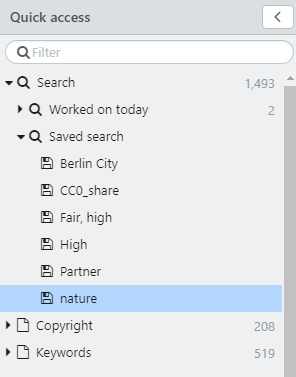

# Saved Search

easydb offers the possibility to save searches in the quick access and reuse them by one click. To safe a search first start a search request using a simple search or the expert search. Save the search query by using the options menu on the right above the hits. The search query is saved with <i class="fa fa-floppy-o"></i> *Save...* under *Search* after entering a name for it.

The saved search can be recalled in the quick access under *Saved searches*. The saved search entries are transferred back into the search bar and can be changed there again.

## Functions in the context menu

For the saved searches there are some functions available via the context menu. The following options are available by clicking the right mouse button.

|Fuction|Detail|Description|
|---|---|---|
|<i class="fa fa-share"></i> Share... ||A saved search can be shared with other users in a similar way as collections. Via the context menu the release settings can be defined. |
||User/Group/Email|Define the release settings for users or groups, which are already registered to easydb. With appropriate system rights (creating new users) you can also add a new user by entering a new email address. Consider that you share the search entries not the linked objects. Keep in mind that users may see different results if they don't have enough rights to see the same results. |
||Create link for external access | Create a link for users who are not registered in easydb (the *pseudo-user must be configured to view individual collections* in the group manager). Consider that you share the search entries not the linked objects. Keep in mind that recipients may see different results if their rights are insufficient for the same results.|
|<i class="fa fa-cog"></i> Settings...|Name|A name for the safed search is mandatory. You can change it here.  |
||Description|Optional description for the saved search.|
||Shortname|Free text field. Can be used for technical purposes as database exports. |
||Reference|Free text field. Can be used for technical purposes as database exports.|
||Link to this collection| This link is the easydb internal link to this safed search. Without any release setting via the tab "Sharing" , other easydb users will not be able to access the safed search using this link.|
|<i class="fa fa-pencil"></i>Rename||Here you can change the name of the saved search and add translations if multilingual fields are used.|
|Delete collection...||Delete the saved search.|

## Overview of all searches in the quick access

Innerhalb der gespeicherten Suchen gibt es auch einen Schnellzugriff auf tagesaktuell erstellte oder veränderte Datensätze.

Within the saved searches, there is also quick access to records created or modified on a daily basis.

|Collection|Subordinate|Description|
|---|---|---|
|<i class="fa fa-search"></i> Search||Corresponds to the current number of records available in easydb. By clicking this line you also return directly from a collection to the main search. The number on the right shows the amount of available records. If you see less than that number in the hit display, you might have not activated all pools or object types for the main search selection. |
||<i class="fa fa-search"></i> Worked an today|Contains the records you have been working on today. The current day is determined from 0:00 to 23:59. For previous changes on records use the [Change history](../../../features/datatypes) in the [Expert search](../../../search). The number on the right shows the amount of records you have worked on today.|
||<i class="fa fa-search"></i> Created |The records that you created today. The number on the right shows the amount of records you have created today.|
||<i class="fa fa-search"></i>Changed|The records that edited today. The number on the right shows the amount of records you have changed today.|
|<i class="fa fa-search"></i> Saved search||The matching hits of your search can be saved by using the otion menu <i class="fa fa-floppy-o"></i>. After saving it with a name, it is stored here and can be reused. Here all records are shown that match the criteria set for the saved search. This number is dynamic. |

