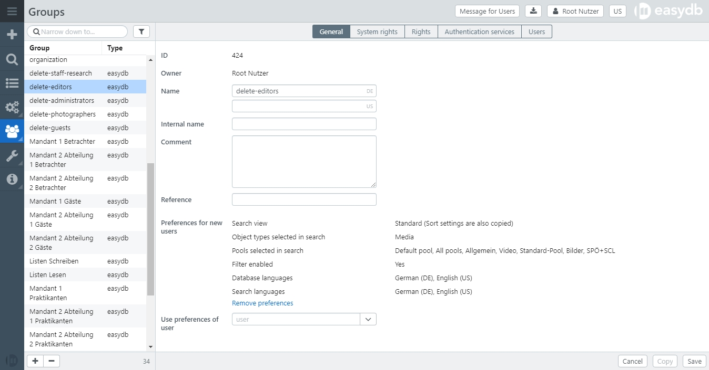

# Groups

Each user can be in one or more groups. This allows a user to have different roles within easydb. The groups are assigned to the user in user management. System groups are groups that are created automatically. Users are automatically members of system groups when they meet the criteria of the system group.

### Overview of system groups

| System Group | Description | Intern |
|---|---|---|
| All Users | Everyone is in this group (incl. anonymous, root, oai_pmh, deep_link, sso, ldap, self-registered). | `:all` |
| All but system users | Everyone is in this group, except for the system users **root**, **oai_pmh** and **deep_link** (see [User types](../users/#user-types)) | `:non_system` |
| Users via Internet | Anyone who has logged in via the Internet. The Internet / Intranet is defined in the [Basic Configuration](../../administration/base-config). | `:internet_connection` |
| Users via Intranet | Anyone who has logged in via the intranet. The Internet / Intranet is defined in the [Basic Configuration](../../administration/base-config). | `:intranet_connection` |
| Users (default) | Users who are created directly in easydb | `:easydb` |
| E-mail users | Users who are only created with their e-mail address for a share sharing or export. | `:email` |
| Unannounced users by folder sharing | Users who are created for a share sharing (collection sharing) that does not require logon. | `:collection` |
| Unannounced users | Users who access records that are not allowed to log on externally. | `:anonymous` |
| SSO Users | Users logging into easydb through SSO. | `:sso` |
| Fallback Group | When a group that is owner of records is deleted, the fallback group is instead registered as owner | `:fallback` |

> NOTE: All users come either from the Internet or from the Intranet. They can therefore not be simultaneously in both groups. The origin of the intranet can be configured using IP address ranges.

## General {#general}

|Setting|Description|
|---|---|
|ID| System ID for this group |
|Owner |Responsible user for the group, who created this group. |
|Name|The name of the group.|
|Interner Name|The internal name of the group. Displayed only here, e.g. For access to groups via API.|
|Comment |An internal comment, which is only displayed here.|
|Referenz| Free text field for custom name or ID, e.g. for migrations or for linking users and groups via the API |
|Preferences for new users|If Preferences have been selected, here all settings are diplayed:   display of search results,   selection of active pools for search,   selection of active object types for search,   active database languages,   active search languages   filters: active or hidden.|
|Use preference of user|Select the user whose prefences are sopposed to be copied for this group. If users are newly created and added to this group, they receive these preferences by default.|

## System rights

For a listing of the system rights, see [Computer Management](..). Note that context-dependent system rights may also be available, if any, not listed here.

## Authorizations

A list of all rights can be found under [Computer Management](..). Please note that not all of the listed rights are available depending on the context.

## Authentication Services
The assignment of users to a rights group can also be done via the sign-on [SSO](/en/sysadmin/configuration/easydb-server.yml/plugins/sso) and [LDAP](/en/sysadmin/configuration/easydb-server.yml/plugins/ldap). This takes users and groups from the systems into easydb. The management of users and groups, including password management, is done outside of easydb. Through log-in services, users are able to register with the same login data in different applications within the system infrastructure.

# User

This tab appears only for easydb groups, not for system groups. All users belonging to this group are displayed here.
