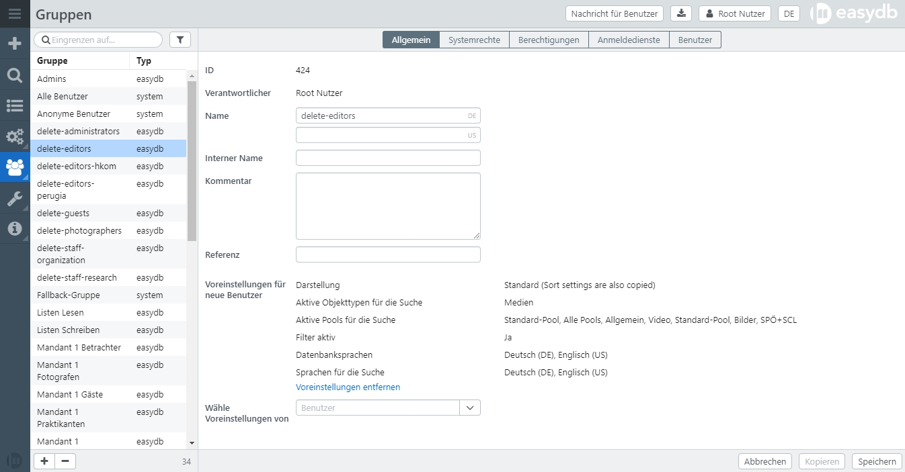

# Gruppen

Jeder Benutzer kann in einer oder mehreren Gruppen sein. Hierdurch kann ein Benutzer unterschiedliche Rollen innerhalb der easydb haben. Die Gruppen werden dem Benutzer im Benutzermanagement zugeordnet. Systemgruppen sind Gruppen, die automatisch erzeugt werden. Benutzer sind automatisch Mitglieder von Systemgruppen, wenn sie die Rechtekriterien der Systemgruppe erfüllen.

### Übersicht Systemgruppen

| Systemgruppe | Erläuterung | Intern |
|--------------|-------------|--------|
| Alle Benutzer | Jeder Benutzer ist in dieser Gruppe. | `:all` |
| Alle außer Systemnutzer | Jeder Benutzer ist in dieser Gruppe, mit Ausnahme der Systemnutzer **root**, **oai_pmh** und **deep_link** (siehe [Benutzertypen](../users/#benutzertypen)). | `:non_system` |
| Benutzer über Internet | Jeder Benutzer, der sich über das Internet angemeldet hat. Das Internet/Intranet wird in der [Basis-Konfiguration](../../administration/base-config) festgelegt. | `:internet_connection` |
| Benutzer über Intranet | Jeder Benutzer, der sich über das Intranet angemeldet hat. Das Internet/Intranet wird in der [Basis-Konfiguration](../../administration/base-config) festgelegt. | `:intranet_connection` |
| Benutzer (Standard) | Benutzer, die in easydb direkt angelegt sind. | `:easydb` |
| E-Mail-Benutzer | Benutzer, die nur mit ihrer E-Mail-Adresse für eine Mappenfreigabe (Collection Sharing) oder beim Export angelegt wurden. | `:email` |
| Unangemeldete Benutzer durch Mappenfreigabe | Benutzer, die für eine Mappenfreigabe (Collection Sharing), die keine Anmeldung erfordert, angelegt wurden. | `:collection` |
| Unangemeldete Benutzer | Benutzer, die ohne Anmeldung auf extern freigegebene Datensätze zugreifen. | `:anonymous` |
| SSO-Benutzer | Benutzer, die sich über SSO in easydb anmelden. | `:sso` |
| Fallback-Gruppe | Wenn eine Gruppe gelöscht wird, die Besitzer (Owner) von Datensätzen ist, wird die Fallback-Gruppe stattdessen als Besitzer eingetragen | `:fallback` |

> HINWEIS: Alle Benutzer kommen entweder aus dem Internet oder aus dem Intranet. Sie können daher nicht gleichzeitig in beiden Gruppen sein. Die Herkunft des Intranet ist anhand von IP-Adressbereichen konfigurierbar.

## Allgemein {#general}

Gruppen können vom easydb Administrator und von Benutzern, die das Systemrecht zur Verwaltung von Gruppen haben, angelegt, verändert und gelöscht werden. Zum Anlegen einer neuen Gruppe besteht die Möglichkeit, eine Gruppe des Typs *:easydb* zu kopieren, um sie dann zu modifizieren.

|Einstellung|Erläuterung|
|---|---|
|Verantwortlicher|Verantwortlicher Benutzer für die Gruppe, von dem die Gruppe erstellt wurde. |
|ID| System ID der Gruppe|
|Name|Der Name der Gruppe.|
|Interner Name|Der interne Name der Gruppe. Wird nur hier angezeigt, z. B. für Zugriff auf Gruppen über API.|
|Kommentar|Ein interner Kommentar, der nur hier angezeigt wird.|
|Referenz| Freitextfeld für die Eingaben einer eigenen Bezeichnung oder ID, z.B. für Migrationen oder für Verlinkungen von Benutzern und Gruppen über die API |
|Voreinstellungen für neue Benutzer|Wenn Voreinstellungen gewählt wurden, werden hier im Einzelnen die Einstellungen angezeigt für:   die Darstellung der Suchergebnisse,   die Auswahl aktiver Pools für die Suche,   die Auswahl aktiver Objekttypen für die Suche,   die aktiven Datenbanksprachen,   die aktiven Sprachen für die Suche,   Filter: aktiv oder verborgen.|
|Wähle Voreinstellungen von|Benutzer wählen, dessen Voreinstellungen für die Gruppe übernommen werden sollen. Werden Benutzer neu angelegt und zu dieser Gruppe hinzugefügt, erhalten sie direkt diese Voreinstellungen. |

## Systemrechte

Eine Auflistung der Systemrechte finden Sie unter [Rechtemanagement](/de/webfrontend/rightsmanagement). Beachten Sie, dass kontextabhängig ggfs. weitere, hier nicht aufgelistete Systemrechte zur Verfügung stehen können.

## Berechtigungen

Eine Auflistung aller Rechte finden Sie unter [Rechtemanagement](/de/webfrontend/rightsmanagement). Beachten Sie, dass kontextabhängig ggfs. nicht alle aufgelisteten Rechte zur Verfügung stehen.

## Anmeldedienste
Die Zuweisung von Benutzern zu einer Rechtegruppe kann auch über die Anmeldedienste [Single-Sign-On (SSO)](/de/sysadmin/konfiguration/sso) und [LDAP](/de/sysadmin/konfiguration/ldap) erfolgen. Hierdurch werden Benutzer und Gruppen aus den Systemen in easydb übernommen. Die Verwaltung der Benutzer und Gruppen inklusive der Passwortverwaltung erfolgt in diesem Fall außerhalb von easydb. Durch Anmeldedienste ist es Benutzern möglich, sich mit den selben Login-Daten in unterschiedlichen Anwendungen innerhalb der Systeminfrastruktur anzumelden.

## Benutzer {#users}

Dieser Reiter wird nur für easydb-Gruppen angezeigt, nicht für Systemgruppen. Hier werden alle Benutzer angezeigt, die zu dieser Gruppe gehören.

