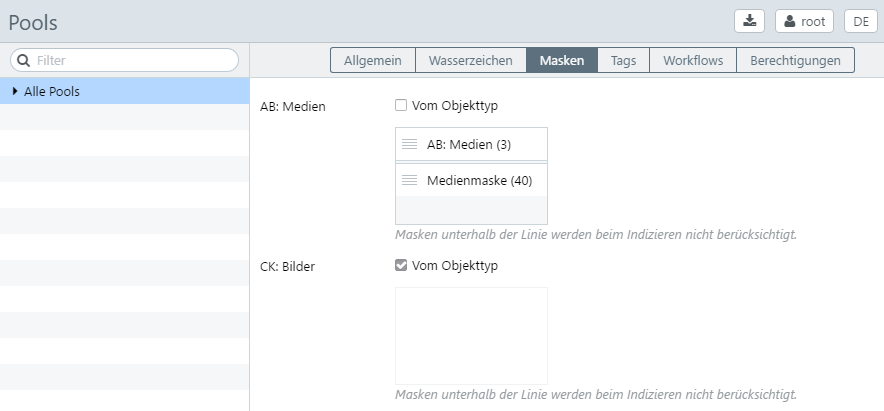

# Pools

easydb speichert Datensätze, für deren Objekttyp *Pool-Management* aktiviert ist, in Pools ab. Pools können genutzt werden, um Datensätze:

* inhaltlich zu strukturieren
* organisatorisch zu strukturieren
* für Abläufe zu unterteilen

Pools werden in einer Hierarchie verwaltet. An oberster Stelle der Hierarchie steht der Root-Pool. Weitere Pools können gleichgeordnet und/oder hierarchisch angelegt werden. Alle Einstellungen, die in einem übergeordneten Pool gemacht werden, strahlen auf alle untergeordneten Pools ab. Diese Einstellung kann bei den untergeordneten Pools überschrieben werden.

> HINWEIS: Namensänderungen von Pools und Wasserzeichen-Einrichtungen können aufwendige Neuberechnungen auf Server-Seite nach sich ziehen.

## Allgemein

Pools können vom easydb Administrator und von Benutzern, die das Systemrecht zur Verwaltung von Pools haben, angelegt, verändert und gelöscht werden. Zum Anlegen eines neuen Pools besteht die Möglichkeit, einen bestehenden Pool zu kopieren, um diesen dann zu modifizieren.

|Einstellung|Erläuterung|
|---|---|
|ID|Wird automatisch bei der Erstellung des Pools vergeben.|
|Verantwortlicher|Standardmäßig ist das der Ersteller des Pools. Andere Benutzer können hier als Pool-Administratoren eingetragen werden. Den Verantwortlichen ändern, können allerdings nur Benutzer, die das Systemrecht *root* haben. Die Rechtekonfiguration für Pool-Administratoren lesen Sie bitte im Kapitel [Mandantenfähigkeit](../../../tutorials/mandanten).   |
|Name|Name des Pools, mehrsprachig. Eine Namensänderung zieht eine komplette Neu-Indizierung aller betroffenen Datensätze mit sich, was unter Umständen einige Zeit in Anspruch nimmt.|
|Ansprechpartner|Ansprechpartner für den Pool. Wird Benutzern in der Pool-Übersicht über <i class="fa fa-info-circle"> </i> angezeigt.|
|Beschreibung (Markdown)|Beschreibung des Pools. Mehrsprachig. Wird dem Benutzer in der Pool-Übersicht über <i class="fa fa-info-circle"> </i> angezeigt. Eingeschränkte Formatierungen können mittels Markdown vorgenommen werden.|
|Referenz| Vergeben Sie hier eine eindeutige Referenz für den Pool um diesen z.B. über die API ansprechen zu können. |
|Kurzname|Vergeben Sie hier einen eindeutigen Kurznamen für den Pool. Anschließend kann der Pool über http://www.ihre-url.de/pool/kurzname angesprochen werden.|
|Export-Profil für Dublin-Core|Wird als Standard-Mapping für Dublin-Core Exporte gesetzt. Der Benutzer kann sich beim Export noch einmal für ein anderes Mapping entscheiden.|
|Export-Profil für Bilder|Standard-Mapping für den Export von Bildern. Der Benutzer kann sich beim Export noch einmal für ein anderes Mapping entscheiden, allerdings gibt es diese Möglichkeit beim einfachen Download nicht. Dort wird das hier eingestellte Mapping verwendet.|
|Import-Profil für Bilder|Standard-Mapping für den Import von Bildern. Der Benutzer kann sich beim Import noch für ein anderes Mapping entscheiden.|

## Wasserzeichen

Für Bilder kann easydb Pool-abhängig ein Wasserzeichen in die Bilder einrechnen. In diesem Reiter legen Sie fest, welches Bild als Wasserzeichen verwendet wird.

|Einstellung|Erläuterung|
|---|---|
|Wasserzeichen|Das Bild|
|Dissolve|Transparenz des Bildes|
|Position|Position des Wasserzeichens als Himmelsrichtung|
|Größe|Größe des Wasserzeichens|
|Kacheln|Wasserzeichen wird als Kachelbild angezeigt.|

> HINWEIS: Das für einen Pool festgelegte Wasserzeichen wird automatisch an untergeordnete Pools vergeben, sofern dort kein eigenes konfiguriert wurde. 
>
> ACHTUNG: Es findet keine Neuberechnung der Wasserzeichen-Versionen statt, wenn nachträglich nur die Optionen "Dissolve", "Position", "Größe" oder "Kacheln" verändert werden. Damit die neuen Einstellungen greifen, muss die Wasserzeichen-Datei erneut hochgeladen werden.

## Masken

Für jeden Objekttyp, für den Pool-Management aktiviert ist, kann hier die Reihenfolge der Masken festgelegt werden, die für den Benutzer zur Anzeige von Datensätzen verwendet wird. Die an erster Stelle stehende Maske wird dann als Standardmaske ausgegeben.

|Einstellung|Erläuterung|
|---|---|
|Vom Objekttyp|Übernimmt die Einstellungen vom Objekttyp, wenn die Checkbox aktiv ist. Ist nur im Root-Pool verfügbar.|
|Vom übergeordneten Pool|Übernimmt die Einstellungen vom übergeordneten Pool, wenn die Checkbox aktiv ist. Ist nicht im Root-Pool verfügbar.|
|&lt;Maske&gt;|Wird die Checkbox für die übergeordneten Einstellungen deaktiviert, erscheinen darunter die verfügbaren Masken. Bringen Sie die Masken per Drag Handle in die gewünschte Reihenfolge. *Hinweis: Wenn Sie die Maske unter die Doppellinie ziehen, wird diese nicht indiziert. Der Benutzer kann Datensätze dann nicht mit dieser Maske sehen. Um die Liste speichern zu können, muss mindestens eine Maske oberhalb der Linie stehen.|

## Tags

Siehe Kapitel [Objekttypen](../objecttypes).

## Workflows

Siehe Kapitel [Objekttypen](../objecttypes).

## Berechtigungen

Hier stellen Sie ein, welche Rechte Benutzer und Gruppen für Datensätze erhalten, die sich in diesem Pool oder in einem der untergeordneten Pools befinden.

|Einstellung|Erläuterung|
|---|---|
|Eigene Rechteliste|Wenn diese Checkbox gesetzt wird, werden Rechte aus den übergeordneten Pools nicht übernommen, es sei denn sie wurden dort als *Persistent* markiert. Diese Funktion ist für den Root-Pool nicht verfügbar.|

Alle weiteren Erklärungen zu den Rechtelisten und eine Übersicht über die Rechte finden Sie [hier](../#rights).
