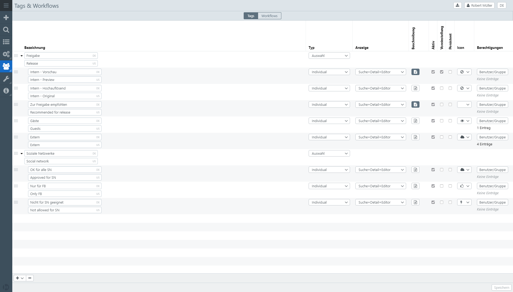
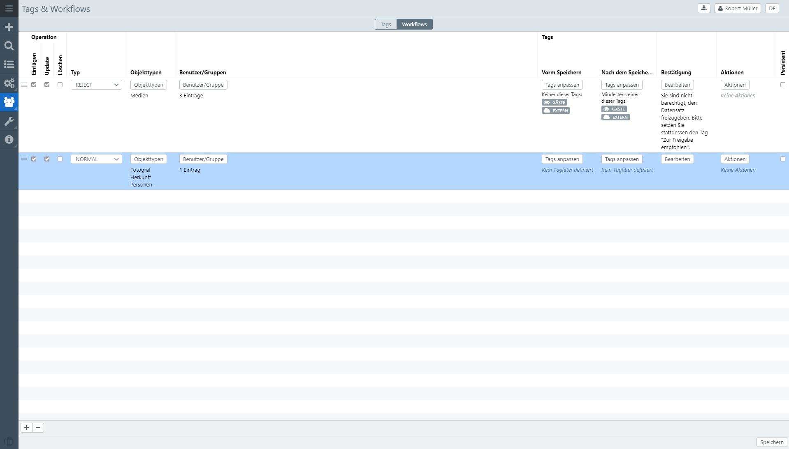

# Tags & Workflows

Tags sind Schalter, die an Datensätzen verwaltet werden können, die zu Objekttypen gehören, bei denen *Tag-Management* aktiviert ist. Sie können beim Editieren diese Tags ein- oder ausschalten.

Nicht alle Tags sind immer überall sichtbar und veränderbar. Das steuern Sie über Workflows, die Tag-Veränderungen überwachen und damit verbieten, erlauben und bestimmt Aktionen ausführen, wenn eine Tag-Veränderung durchgeführt wurde.

Tags können auch genutzt werden, um Datensätze für den Benutzer mit kleinen Symbolen zu markieren.

Tags werden auch genutzt, um Rechtemanagement durchzuführen. Das ist allerdings ein sehr mächtiges Instrument. Da das easydb Rechte-Management additiv funktioniert, kann ein einmalig (durch einen Tag) vergebenes Recht nicht wieder entzogen werden.

> Tags werden global definiert. Das ist sinnvoll, um den Überblick zu behalten und nicht innerhalb einzelnen Pools ein Tag-Chaos entstehen zu lassen. Tags können allerdings je Pool oder Objekttyp ein- und ausgeschaltet werden. Pools und Objekttypen können ihre eigenen Workflows definieren, unter Verwendung der systemweiten Tags.

Tags können zur besseren Übersicht in Gruppen strukturiert werden. Eine Tag-Gruppe kann auch als *Auswahl* definiert werden. In dem Fall wird nur der ausgewählte Tag aus der Gruppe aktiviert.

## Tags

|Einstellung| |Erläuterung|
|---|---|---|
|Bezeichnung| |Anzeigename des Tags oder der Tag-Gruppe. Mehrsprachig. Achten Sie auf kurze erklärende Begriffe, z. B. *Status*, *Gesperrt*, *Internet freigegeben*, *Überprüfen*, *Freigegeben*, *Ok*.|
|Typ|Checkbox|Tag-Gruppe, die aus Einzel-Tags, die individuell an- und ausgeschaltet werden können, besteht. Nur für Tag-Gruppen.|
| |Auswahl|Tag-Gruppe, die aus einer Tag-Auswahl besteht. Hier kann nur einer oder kein Tags ausgewählt sein, nicht aber mehrere.|
| |Individual|Normaler Tag zum Ein- und Ausschalten. Nur für Tags.|
| |Alle Versionen|Ein Tag, der für alle Versionen eines Datensatzes gilt. Dieser Tag wird in alten Versionen eines Datensatzes ignoriert. Das wird verwendet, um Datensätze in redaktionell freigegebenen Versionen zu indizieren. Die Einstellung dazu erfolgt je [Objekttyp](../objecttypes)|
|Anzeige|Editor|Tag wird nur im Editor angezeigt.|
| |Detail+Editor|Tag wird zusätzlich auch im Detail angezeigt (wenn gesetzt).|
| |Suche+Detail+Editor|Tag ist zusätzlich noch suchbar.|
| |Filter+Suche+Detail+Editor|Der Tag wird auch im Filter angezeigt.|
| |Nicht anzeigen|Tag wird nicht angezeigt. Das kann sinnvoll sein, wenn Sie Workflows definieren wollen, die mit verborgenen Tags arbeiten.|
|Beschreibung||Optionaler Text, der dem Benutzer in einem Tooltipp angezeigt wird. Mehrsprachig.|
|Voreinstellung||Wenn gesetzt, ist der Tag für neue Datensätze standardmäßig angeschaltet.|
|Persistent||Wenn gesetzt kann der Tag bei [Objekttypen](../objecttypes) und [Pools](../pools) nicht de-aktiviert werden.|
|Icon||Ein optionales Icon. In Verbindung mit der Anzeige im Suchergebnis und Detail wird dieses Icon verwendet, um den Datensatz zu markieren.|
|Rechte||Hier stellen Sie ein, welche Rechte Benutzer und Gruppen an Datensätzen haben, bei denen dieser Tag angeschaltet ist. Eine Übersicht über die Rechte finden Sie [hier](/de/webfrontend/rightsmanagement).|

## Workflows

Die Workflows werden ausgeführt, wenn Datensätze angelegt, gespeichert oder gelöscht werden. easydb sammelt vor dem Speichern, Anlegen oder Löschen auf die Aktion passende Workflows und führt sie nacheinander aus.

> Wenn Workflows angelegt sind, muss mindestens ein Worflow auf die Aktion passen, sonst wird die Aktion nicht ausgeführt. Wenn keine Workflows angelegt sind, wird jede Aktion erlaubt (im Rahmen des Rechtemanagements).

Eine Operation passt dann auf einen Workflow, wenn folgende Prüfungen bestanden sind:

* Die *Operation* muss passen (Insert, Update, Delete).
* Der *Benutzer* bzw die *Gruppe* muss auf den ausführenden Benutzer passen.
* Die *Tagfilter* *Vor dem Speichern* und *Nach dem Speichern* müssen passen
* Der Benutzer muss die Operation bestätigt haben (falls eine Bestätigung erforderlich ist)

Wenn alle Workflows bestätigt wurden, wird die Operation ausgeführt und im Anschluss werden Aktionen durchgeführt, die mit den Workflows verbunden sind. Derzeit unterstützt easydb die folgenden Aktionen:

* Email verschicken
* Tags setzen oder entfernen

|Einstellung| |Erläuterung|
|---|---|---|
|Operation|Insert|Die Operation ist ein Neu-Anlegen eines Datensatzes.|
| |Update|Die Operation ist eine Aktualisierung eines Datensatzes.|
| |Delete|Die Operation ist das Löschen eines Datensatzes.|
|Benutzer/Gruppen||Legen Sie fest, für welche Benutzer oder/und Gruppen der Workflow gelten soll.|
|Tagfilter|Vor dem Speichern|Legt einen Tagfilter vor dem Speichern fest. Datensätze müssen vor der Aktion auf den Tagfilter passen, damit der Workflow Anwendung findet. Dieser Tagfilter wird für neue Datensätze ignoriert.|
| |Nach dem Speichern|Legt einen Tagfilter nach dem Speichern fest. Datensätze müssen in der zu speichernden Version auf den Tagfilter passen, damit der Workflow Anwendung findet. Dieser Tagfilter wird beim Löschen ignoriert.|
|Bestätigung||Geben Sie hier einen Text ein, den der Benutzer sieht und bestätigen muss, wenn der Workflow ausgeführt wird. Beispielsweise bietet sich so ein Text vor einer Internet-Veröffentlichung an. Dieser Text ist mehrsprachig.|
|Aktionen||Aktionen werden in der angegeben Reihenfolge ausgeführt, nachdem alle Workflows bestätigt wurden und die eigentliche Operation durchgeführt wurde.|
|Persistent||Wenn gesetzt, kann der Tag in untergeordneten Ebenen (Objekttypen, Pools) nicht mehr überschrieben werden.|

> Eine Erklärung wie Tagfilter funktionieren finden Sie [hier](/de/webfrontend/rightsmanagement).
