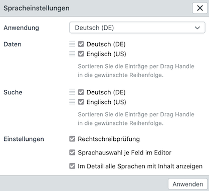

# Spracheinstellungen

easydb bietet die Möglichkeit, mehrere Sprachen für die Anwendung (System), die Daten und die Suche zu aktivieren, sofern die Funktion für Mehrsprachigkeit von dem easydb-Administrator installiert wurde.

|Einstellung|Erläuterung|
|---|---|
|Anwendung| Sofern Mehrsprachigkeit hinterlegt wurde, können Sie hier die Sprache des Systems wählen. Alle Anwendungsfunktionen erscheinen dann in dieser Sprache.|
|Daten|Wählen Sie hier die Sprache(n) für die Eingabe und Anzeige der Daten. Die Auswahl mehrerer Sprachen ist möglich. Die Reihenfolge der Sprachen kann verändert werden. Die Reihenfolge kann durch Ziehen der Einträge mit der linken Maustaste an die gewünschte Stelle verändert werden.|
|Rechtschreibprüfung|Durch Aktivieren der Rechtschreibprüfung werden die Dateneinträge bei der Eingabe überprüft. Hierfür wird die Rechtschreibprüfung des Browsers genutzt. Überprüfen Sie zunächst in Ihren Browsereinstellungen, ob die Rechtschreibprüfung aktiviert ist.|
|Suche| Aktivieren Sie diese Einstellung, um die Suche in einer oder mehreren Sprachen durchzuführen. |
|Sortierung| Sind mehrere Sprachen gewählt, kann durch ziehen mit Drag & Drop die Position der Sprache geändert werden. Die oben stehende Sprache wird entsprechend im Datenmodell oben angezeigt. |

## Sortierung von Sprachen

Wenn Mehrsprachigkeit für die Suche verwendet wird, aber die Übersetzungen der Einträge nicht in allen Sprachen vollständig enthalten sind, kann durch die Sortierung der unter Suche geführten Sprachen dem Server vorgegeben werden, in welcher Reihenfolge die Sprachen für den Eintrag angezeigt werden soll.

Wenn ein bestimmter Wert in einem Feld in der Standard-Ansicht erscheinen soll, aber wie im unten angegebenen Beispiel nicht alle Sprachen vorhanden sind, kann der fehlende Wert durch eine andere ausgefüllte Datenbanksprache angezeigt werden.

Beispiel:

    Datensatz 1: Wasser / Water
    Datensatz 2: Feuer / (nichts)
    Datensatz 3: (nichts) / Air

In der Standard-Ansicht erscheint nur ein Wert. Je nachdem, ob die Reihenfolge der Datenbanksprachen hier z.B. Englisch-Deutsch oder Deutsch-Englisch eingestellt ist, sieht die Anzeige der Ergebnisse folgendermaßen aus:

Englisch-Deutsch: Water, Feuer, Air

Deutsch-Englisch: Wasser, Feuer, Air
