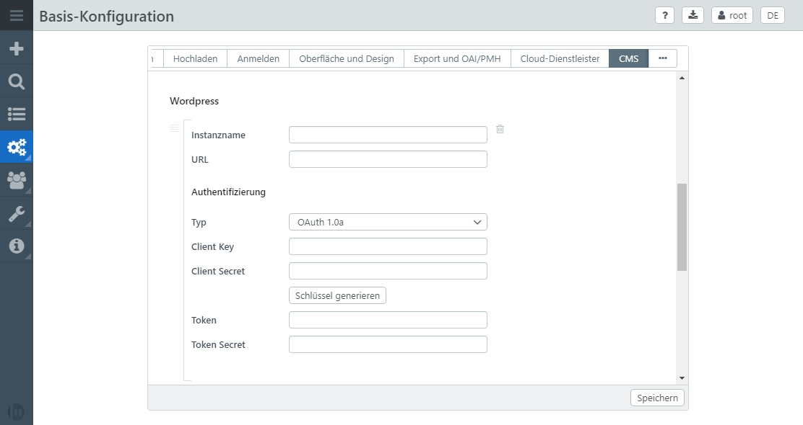
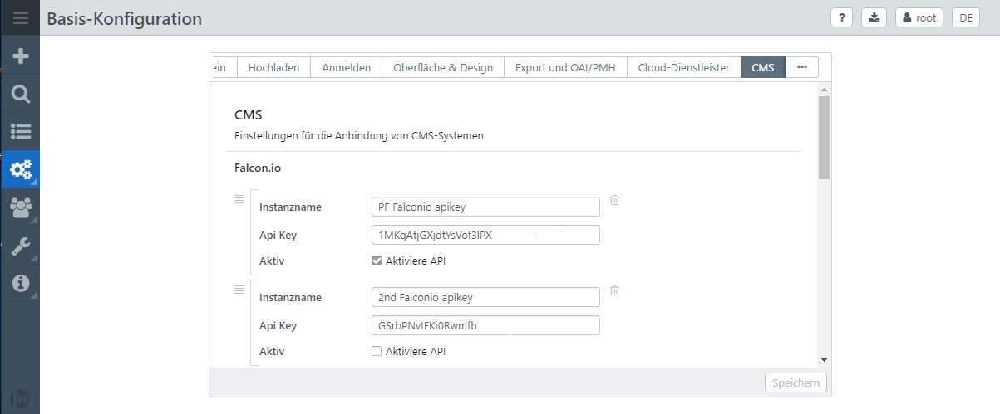
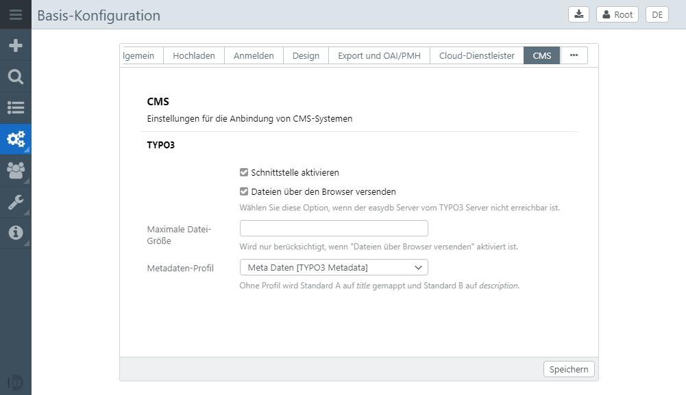

# Basis-Konfiguration

## Allgemein

|Einstellung | | Erläuterung |
|------|--|--------|
|Name der easydb| | Der Name der easydb wird als Verzeichnis-Name und ZIP-Prefix Exporte verwendet. Auch ist es der Name der easydb, wie er in Logs und Administrator-E-Mails erscheint. |
|Anzeigename | | Name der easydb wie er im Web-Browser angezeigt wird (als Dokument-Titel). Dieses Feld ist mehrsprachig. |
|Sprachen | Frontend | Die Frontend-Sprachen sind die Sprachen, die für End-Anwender zur Auswahl zur Verfügung stehen.  _Die aufgelisteten Sprachen sind Server-seitig fest eingestellt und können nicht verändert werden._|
|         | Datenbank | Die Datenbank-Sprachen sind die Sprachen die für End-Anwender für die Datenmodellierung und -Eingabe sowie die Suche zur Verfügung stehen.  _Die aufgelisteten Sprachen sind Server-seitig fest eingestellt und können nicht verändert werden._ |
|Administrator-Emails| |Administrator-E-Mails können angegeben werden. easydb schickt solche Emails, bei folgenden Events: server_start, server_shutdown, ...|
|Erlaubte Herkunftsadresse| |URLs von denen ein Fremd-Browser-Zugriff erlaubt werden soll. Die URLs müssen vollständig mit Protokoll angegeben werden. Zum Beispiel "​​http :// myown.easydb.api.example. com" |
|Benutzer-Aktivität loggen |Suchanfragen loggen |Protokolliert die Suchanfragen der Benutzer. |
| |Login / Logout loggen |Protokolliert Login- und Logout-Events eines Benutzers. |
| |Detail-Anzeige loggen |Protokolliert die Aufrufe einer Detail-Ansicht. |
| |Loggen, wenn ein Nutzer ein Asset hochlädt |Protokolliert das Hochladen eines Assets durch einen Benutzer. |
| |Loggen, wenn ein Nutzer einen Export herunterlädt |Protokolliert das Herunterladen eines Exports durch einen Benutzer. |
| |Loggen, wenn ein Nutzer ein Asset aus einem Export herunterlädt |Protokolliert das Herunterladen eines Assets aus einem Export durch einen Benutzer. |
|Autovervollständigung|Wann||
||Umfang||
|System-Adressen|Absender||
||Envelope-Absender||
|API-Calls loggen|||
||aktiv|hier wird festgelegt ob und welche Logs in easydb gemacht werden|
||folgende Calls loggen|über die Checkboxen können die Calls, die geloggt werden sollen, definiert werden|

## Hochladen

Unter diesem Reiter werden globale Limits für Uploads (Hochladen von Assets in easydb) definiert.

|Einstellung | | Erläuterung |
|----|--|---|
|Upload-Limit | | Das Globale-Upload Limit in Bytes. Wenn ein Upload größer ist, wird er in jedem Fall abgelehnt, auch wenn per Rechtemanagement andere Werte eingestellt sind. |
|_Datei-Klasse_ | Limit | Pro Datei-Klasse kann ein eigenes Limit definiert werden. Wenn es größer ist als das globale Upload-Limit, wird es ignoriert. |
|				| Typ | Es werden nur die Formate für einen Upload akzeptiert, die hier aktiviert sind. Für die Datei-Klasse _Sonstige_ werden immer alle Formate erlaubt, die nicht in einer der anderen Datei-Klasse aufgelistet sind. |

## Anmelden

Unter diesem Reiter können Einstellungen für den Login vorgenommen werden.

|Einstellung | | Erläuterung |
|-----|--|---|
|Anonym über Internet erlaubt| |Bei Aufruf der Haupt-easydb-URL (http://<easydb-server>/) wir mit dieser Einstellung festgelegt, dass ein unbekannter Benutzer als anonymer Benutzer am System angemeldet wird. Jeder anonyme Benutzer ist automatisch in der Gruppe `Anonymer Benutzer` und kann darüber mit Rechten ausgestattet werden. easydb hinterlegt beim Benutzer einen Browser-Cookie mit dem er beim nächsten Mal wiedererkannt wird und intern derselben Benutzer-ID zugeordnet wird. Für den Benutzer können dadurch Benutzer-Einstellung usw. gespeichert werden. Ob ein Benutzer aus dem Internet kommt oder nicht, wird über _Intranet-Konfiguration_ festgelegt.|
|Anonym über Intranet erlaubt| |Wie *Anonym über Internet erlaubt* nur dass sich diese Einstellung auf Benutzer bezieht, die als Intranet-Benutzer erkannt wurden.|
|Intranet-Konfiguration| |Hier werden IP-Adressen (172.16.0.2) und Netze (zb. 192.168.0.0/16) hinterlegt, die als _Intranet_ gelten. Beim Aufruf des Servers wird die IP-Adresse des Aufrufes festgestellt und eine entsprechende Einordnung vorgenommen.|
|Vergessene Passwörter können angefordert werden.| |Wenn aktiv, wird dem Benutzer auf der Anmeldeseite eine Möglichkeit angeboten, über seine hinterlegte E-Mail-Adresse ein neues Passwort zu setzen. Diese Einstellung gilt systemweit für alle Benutzer und nicht deaktiviert entzogen werden.|
|Hintergrundbild| |Für die Login-Seite kann ein Hintergrund-Bild hochgeladen werden. Ein Standard-Bild wird in der .ini-Variable `[default-pics]background` festgelegt. Achten Sie darauf, dass das Bild groß ist, so dass für große Bildschirme keine Artefakte sichtbar werden.|
|Begrüßungstext| |Der Begrüßungstext kann für die Login-Seite mehrsprachig hinterlegt werden. Hier ist nur Text erlaubt, kein HTML.|
|Passwort-Überprüfung|Policy|Legen sie mit +/- Regeln zur Überprüfung von Passwörtern fest. Über ein Regulären-Ausdruck wird das Passwort geprüft. Mit _Minimum_ und _Maximum_ legen sie fest wie oft der Reguläre Ausdruck mindestens gefunden werden muss und maximal gefunden werden darf.|
| |Hinweis|Der mehrsprachige Text erklärt dem Benutzer, was er bei seinem Passwort beachten muss.|
|Wiederholte Passwörter erlauben| |easydb speichert alle vom Benutzer benutzen Passwörter (verschlüsselt). Für wiederverwendete Passwörter kann festgelegt werden, wie alte ein Passwort sein darf.|
| | _Immer_ | Ein Passwort darf niemals wiederverwendet werden. |
| | _Monat_ | Ein Passwort darf im selben Monat nicht wiederverwendet werden. |
| | _Niemals_ | Der Server schaltet die Überprüfung nach wiederholten Passwörtern ab. |
|Anmeldedienste: SSO|Text für Anmeldelink |Eigenen Anmeldetext für den Link zum Authentifizierungsdienst hinterlegen. Beleibt das Feld leer wird standardmäßig "Anmeldedienst verwenden" angezeigt. |

## Erweiterte Funktionen {#design}

|Einstellung||Erläuterung|
|--|--|--|
|Logo & Kopfzeile|||
||Logo | Das Logo kann hochgeladen werden. Es wird in der Original-Auflösung und im Original-Format oben rechts angezeigt. Mit Mausrad + Move kann das Logo justiert werden. Über die .ini-Variable `[default-pics]logo` kann ein Pfad zu einem Standard-Bild festgelegt werden. |
||Hintergrundfarbe| Hintergrundfarbe für das Logo wählen. |
|Dokumentation|Link-Button|Aktiviert im Frontend den Link-Button zur easydb Dokumentation. Der Button erscheint oben rechts in der Zeile neben den Benutzereinstellungen.|
||URL|Bleibt diese Feld leer, führt der Link standardmäßig zur allgemeinen easydb-Dokumentation. Es kann ein eigener Link zu einer individuellen Dokumentation hinterlegt werden.|
|CSS-Dateien||Eigenes Design für easydb erstellen.|
|Karten-Einstellungen|[Karten im Detail](/webfrontend/datamanagement/search/detail/detail.html#geotag) anzeigen|Anzeige des Thumbnails in einer Karte, wenn die Datei Geokoordinaten enthält.|

Bei geladenem CSS-Plugin (Standard) erscheinen hier Eingabefelder zum modifizieren des geladenenen CSS. Das CSS-Plugin erkennt, wenn dsich die angegebenen URLs ändern und stellt ein neues CSS für die Applikation bereit. Benutzen Sie auch das Tool [CSS-Developer], um mehr Übersicht über die geladenenen SCSS-Dateien zu bekommen.

Das CSS der easydb ist in [SCSS](http://sass-lang.com/) erstellt.

### CSS-Dateien

|Einstellung| Erläuterung |
|------|--------|
|Header| Hier können URLs zu SCSS-Dateien angegeben werden, die vor dem Header-SCSS der easydb geladen werden. |
|Body| Hier können URLs zu SCSS-Dateien angegeben werden, die nach dem Body-SCSS der easydb geladen werden. |
|Footer| Hier können URLs zu SCSS-Dateien angegeben werden, die nach dem Footer-SCSS der easydb geladen werden. |

## Export und OAI/PMH

easydb stellt verschiedene Arten des unauthentifizierten Zugriffs auf die Dateien und Daten bereit. Für die Zugriffe stehen zum einen Deep-Links und zum anderen OAI/PMH zur Verfügung.

Nutzen Sie Deep-Links wenn es darum geht eine Ressource aus der easydb direkt im Zugriff zu haben, OAI/PMH kann genutzt werden um mehrere Ressourcen und auch Veränderungen an Ressourcen zu überwachen und zu laden.

### Deep-Link

Die Deep-Link-Freigaben sind technisch über die API-Schnittstelle [/api/objects](https://docs.easydb.de/en/technical/api/objects/objects.html) gelöst. Dort finden sich explizite Informationen über den Aufbau der URL. Im Frontend finden Sie an verschiedenen Stellen diese Deep-Links [Detail(Teilen)]() und im [EAS-Column(Teilen/) und im [EAS-Column(Teilen.html)](). Deep-Links werden immer über den Benutzer *DeepLink* authentifiziert. Geben Sie diesem Benutzer die nötigen Rechte an den Daten, damit der Zugriff von außen erfolgen kann.

|Einstellung | Erläuterung |
|----|---|
|erlauben| An- und Ausschalten der Deep-Link-Schnittstelle. |
|inklusive sichtbarer Referenz auf ID| Erlaubt einen direkt Zugriff per Objekt-ID. Da diese Objekt-IDs fortlaufend vergeben werden, kann es ein Sicherheitsrisiko sein, diese Option freizuschalten. Ein Benutzer dem ein Deep-Link bekannt gemacht wird, kann durch probieren weitere Deep-Links erraten. Für alle Deep-Links gilt aber immer, dass der *DeepLink*-Benutzer auf die Objekte Zugriff haben muss, damit sie funktionieren. |
|inklusive sichtbarer Referenz auf ein eindeutiges Feld| Wie die Referenz auf ID legen sie hiermit fest, ob über eineindeutige Datenfelder ein Deep-Link-Zugriff erfolgen darf oder nicht.|
|EAS-URLs anzeigen|Mit dieser Option werden direkte Datei-Links in der z. B. XML Ausgabe der Deep-Links geschrieben. Diese Links zielen direkt auf eine Datei und sind nicht mehr rechte-gemanagt. Diese URLs verlieren nie ihre Gültigkeit. Ohne diese Option stehen im XML noch anderen URLs für den Zugriff auf Dateien zur Verfügung. |
| Verlinkte Datensätze einbetten | Verlinkte Objekte sind, wie beim XML-Export, standardmäßig nicht im XML-Dokument enthalten. Wird die Option "Nicht in der Hauptsuche enthaltene Datensätze" gewählt, werden während des Exports alle verlinkten Objekte, die nicht in der Hauptsuche enthalten sind, nachgeladen und im XML eingebettet. Wird "Keine" ausgewählt, werden keine verlinkten Datensätze nachgeladen, sondern nur der Standard wird exportiert. |

### OAI/PMH

Die OAI/PMH-Schnittstelle ist eine Harvesting-Schnittstelle. Mehr Informationen dazu finden Sie in der [Protokoll-Beschreibung](https://docs.easydb.de/en/technical/protocols/oai-pmh/oai-pmh.html) und auf [Openarchives](http://www.openarchives.org/).

Die Suchen die die Schnittstelle durchführt, werden mit dem System-Benutzer *OAI/PMH* durchgeführt. Geben Sie diesem Benutzer die Rechte Daten zu sehen.

|Einstellung | Erläuterung |
|----|---|
|Freigeben| An- und Ausschalten der OAI/PMH-Schnittstelle. |
|Repository-Name| Name des OAI/PMH-Repository. |
|Administrator-E-Mail| Email die in den OAI-Antworten angegeben ist.|
|Namespace| Frei definierbarer OAI-Identifier-Namespace. Objekte können beispielsweise über `oai:<namespace>:<uuid>` in der URL angefordert werden. |
|Tag-Sets|Definieren Sie hier Tagfilter, um neue OAI/PMH-Sets zu erzeugen. Sie können damit z.B. alle Objekte zusammenfassen, die den Tag *Internet* haben. |
|EAS-URLs anzeigen|Wie bei den Deep-Links wird damit festgelegt, ob die direkten Datei-Links im XML ausgeben werden oder nicht. Siehe Deep-Link.|

#### XSLT-Formate

Die OAI/PMH-Schnittstelle kann neben dem Standard-easydb-Format und [Dublin-Core](http://dublincore.org/) (das ist Pflicht bei OAI-PMH) eigen definierte Formate bereitstellen (z.B. LIDO). Um Dublin Core zu nutzen, muss im Bereich [Metadaten-Mapping](../profiles/profiles.html) ein Dublin-Core-Mapping eingerichtet werden. Darüber hinaus muss dieses im Anschluss beim entsprechenden [Objekttyp](../datamodel/objecttype/objecttype.html) verknüpft werden. Für diese Formate muss ein XSLT erstellt werden, welches das Standard-easydb-Format umwandelt. Die OAI/PMH-Schnittstelle stellt je hochgeladenem XSLT ein Metadaten-Format bereit.

|Einstellung | Erläuterung |
|----|---|
|OAI/PMH-Präfix| Technischer Name des Formates in der OAI/PMH-Schnittstelle. |
|Anzeigename| Anzeigenname des Formates im XML der OAI/PMH-Schnittstelle. |
|Beschreibung| Beschreibung des Formates im XML der OAI/PMH-Schnittstelle. |
|XSLT| XSLT-Datei zur Tranformation der Daten. |

## Cloud-Dienstleister

## CMS

Für die Anbindung von CMS-Systemen können [Plugins](/webfrontend/datamanagement/features/plugins/plugins.html) genutzt werden. Hier werden die Einstellungen für die Anbindung von CMS-Systemen vorgenommen.

### Wordpress {#wordpress}

|Eingabefeld|Erläuterung|
|--|--|
|Instanzname|Hier können eine oder mehrere Instanzen angelegt werden. Pro Instanz muss ein Name vergeben werden. |
|URL| URL der Wordpress-Instanz, in die Medien transportiert werden sollen.|
|Authentifizierung|Authentifizierungstyp HTTP:   Loginname uns Passwort zur Wordpress-Administration.|
||Authentifizierungstyp OAuth 1.0a:  Kopieren Sie den Client Key und das Client Secret vom (vorbereiteten) Applikationsbenutzer aus Wordpress   Klicken Sie "Generate Key" um sich mit Wordpress zu verbinden, sich zu authentifizieren und ein Token bzw. Token Secret zu erhalten.|

> HINWEIS: Vorausgesetzt sind min. Wordpress 4.7, eine aktive JSON-Rest-API (ist default) und eine eingerichtete Authentifizierung. Für die Verwendung im Frontend muss für den Benutzer oder die Gruppe das [Systemrecht](/webfrontend/rightsmanagement/rightsmanagement.html#aclsystem) "Wordpress Export erlauben" für Wordpress aktiviert werden.

Eine Anleitung zur Installation des Plugins ist [hier](/sysadmin/plugin/plugin.html#wordpressplugin).

### Falcon.io {#falconio}

|CMS|Eingabefeld|Erläuterung|
|--|--|--|
| Falcon.io | Instanzname | Hier können eine oder mehrere Instanzen angelegt werden. Pro Instanz muss ein Name vergeben werden. |
|| API_Key | Die genereierten unique API Key um deine RESTful API zu nutzen. |
|| Aktiv | Über die Checkbox kann die API zu der jeweiligen Instanz aktiviert und deaktiviert werden. |

### TYPO3 {#typo3}

Nach erfolgreicher [Pluginkonfiguration](../../../sysadmin/konfiguration/plugin/plugin.html) in einer [YAML-Datei](../../../sysadmin/konfiguration/yaml/yaml.html) durch einen System-Administrator, können hier Einstellungen für das TYPO3-Plugin vorgenommen werden.

|CMS|Eingabefeld|Erläuterung|
|--|--|--|
|TYPO3|Schnittstelle aktivieren|Aktiviert das [Plugin](../../datamanagement/features/plugins/plugins.html). |
||Dateien über den Browser versenden| Über das Plugin in TYPO3 wird easydb für den Export von Dateien erreicht. Ist der Export vom easydb-Server zum Typo3-Server nicht direkt möglich, kann die Option zum Export über den Browser aktiviert werden.|
||Maximale Datei-Größe| Limit für Dateien wenn diese über den Browser verschickt werden sollen. |
||Metadaten-Profil|Einstellung für Metadaten-Mapping beim Export von easydb zu TYPO3.  **- Standard -**: Ohne Profil wird Standard A auf *title* gemappt und Standard B auf *description*.   **Eigenes Mapping**: Individuelle Mappings können unter [Metadaten-Mapping](../profiles/profiles.html) angelegt werden. Diese stehen dann über das Pulldown zur Auswahl. |
