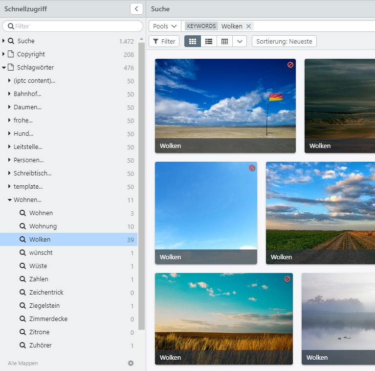

# Kategoriebrowser

Nebenobjekttypen können über das [Objekttypen-Management](/webfrontend/rightsmanagement/objecttypes/objecttypes.html) für den Schnellzugriff aktiviert werden. Sie erscheinen dann unterhalb der gespeicherten Suchen. 

|Mappe|Erklärung|
|--|--|--|
|<i class="fa fa-file-o"></i> Kategoriebrowser|Wenn aktiviert, erscheinen hier Listen von Nebenobjekttypen, über die ein schneller Zugriff auf verknüpfte Datensätze möglich ist. Der Kategoriebrowser ist eine Filtermethode, die als Schnellzugriffsvariante dient und entsprechend der Eingabe über die Expertensuche agiert. Die Zahl rechts neben der Kategorie zeigt die Summe der Einträge, die zur Kategorie gehören. Die Zahl rechts neben den einzelnen Kategorieeinträgen zeigt, die Anzahl der verknüpten Datensätze an. |

Der Nebenobjekttyp _Schlagwörter_ im Screenshot enthält in diesem Beispiel 476 Datensätze. Die Datensätze werden alphabetisch ausgegeben und in Paketen von bis zu 50 Einträgen gruppiert. Die Zahl hinter den einzelnen Datensätzen (z. B. "<i class="fa fa-search"></i> Wolken") zeigt die Anzahl verknüpfter Datensätze an, für die "Wolken" in den Schlagwörten enthalten sind. 

Durch Klick auf einen Eintrag wird dieser in die Suchspalte übernommen und die verknüpften Datensätze in der Trefferanzeige angezeigt. 

Falls weniger Treffer angezeigt werden, kann es sein, dass nicht alle Pools und/oder Objekttypen in der Suchauswahl aktiv sind oder Ihnen dafür die Rechte fehlen.

