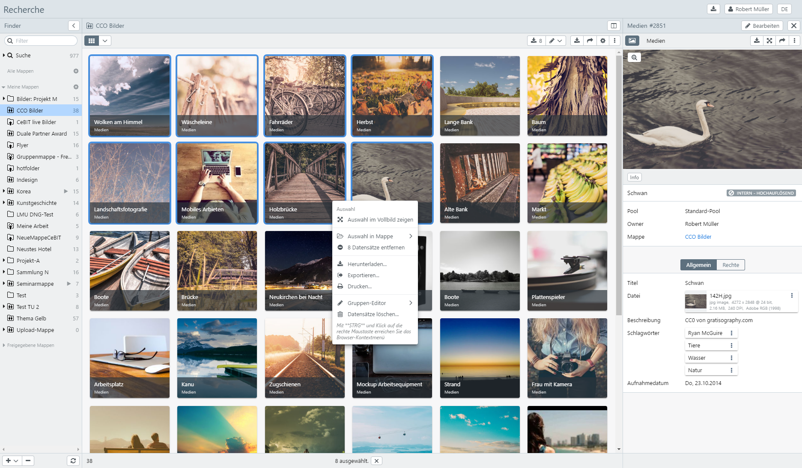
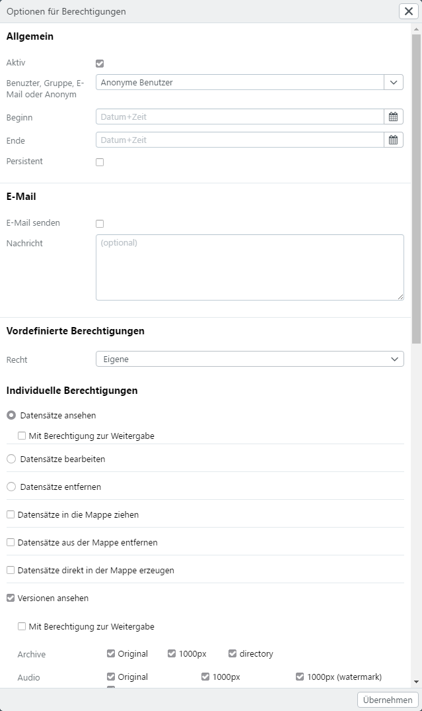

# Quick access (Saved Searches & Folders)

The quick access allows you to manage sets of data sets. These are, on the one hand, dynamic portfolios, such as stored searches and ad hoc portfolios for data records processed on a daily basis. And on the other hand, manual compilations, including own and shared folders. With <code class="button"><</code> the quick access can be switched on and off.

## Overview in quick access

Easydb offers the following folders in the folder overview:

|Colleciton|Subordinate|Description|
|--|--|--|
|<i class="fa fa-search"></i> Search||Corresponds to the current number of records available to you in easydb. From a map you can go directly back to the main search via this route.|
||<i class="fa fa-search"></i> Today edited | Contains the records you edited today. The current day date is used for this purpose, therefore 0:00 to 23:59 of the current day. For more complex searches that go back in time, a query of the [change history](../../features/datatypes/datatypes.html#changelog-search) can be carried out in the [expert search](../search.html#expert).|
||<i class="fa fa-search"></i> Created |The records that you created today.|
||<i class="fa fa-search"></i> Edited| Records that were edited by you today.|
|<i class="fa fa-search"></i> Saved Search||The results of a search can be stored in the <i class = "fa fa-floppy-o"> </i> menu and can be accessed again at this point. This folder is dynamic. All the records matching the saved search criteria are displayed.|
| My Collections || User-created sets of records. |
| Shared Collections || Compilation of records shared by other users. The authorizations are applied to the folder that the creator has assigned

### Create and delete folders

A folder can be created in the quick display via the <code class="button">+</code>. Marked records can then be dragged from the hit display into the folder by drag & drop. A folder can also be created from the hit display. The context menu for selected records is called. With <code class="button">-</code> a marked folder can be removed again.

### Find the folder

You can search for folders using the search field. The matching of the input in the search field with a matching folder is highlighted in color. Folders that do not match the input are hidden.

## Portfolios in Detail

Among the dynamic search folders are your own folders and folders shared by other users. By clicking on <i class = "fa fa-chevron-right"> </i> *My folders* or <i class = "fa fa-chevron-right"> </i> Displayed or hidden. If you still hold the Ctrl key at the same time, all hierarchically subordinate folders in the tree are opened. By clicking on a folder, the contents of the folder are displayed on the right in the detail. Double-clicking on a data record opens the detail view to the right. In the display above the contents of the folder is the split button <i class = "fa fa-columns"> </i>, which opens the[search](./find/find.html) next to the folder.

> NOTE: The sequence of the records in the folder can be changed with drag & drop.

### Functions

Right-clicking on a folder opens the context menu with functions for the folder. If you select records in the folder and from there open the context menu with the right mouse button, additional functions for the records are displayed. The functions can also be accessed via the toolbar above the detail view for the folder.

The following functions are available for folders using the context menu:

|Function|Context Menu| Description |
|--|--|--|
|<i class="fa fa-search"></i>|Show in the search | Creates a search element in the search and displays the contents of the map as a hit. The search can be further extended by further search elements.|
|<i class="fa fa-arrows-alt"></i>|Show in full screen | Displays the contents of the map in easydb full screen.|
|<i class="fa fa-expand"></i>||Available in full screen mode. Opens the view as a full-screen browser.|
|<i class="fa fa-download"></i>| Download...|Save the data from the collection locally. This opens the selection menu dialogue to choose the download settings. |
|<i class="fa fa-sign-out"></i>|Export...|Open the  [Export-Menu](../../features/export/export.html) to export the collection.|
|<i class="fa fa-print"></i>| Print...|Open the Print dialogue for all of the Records in the collection. |
|<i class="fa fa-share"></i>|Share...|Open the [Share-Menu](#share) for the collection. This may allow other easydb users to interact with the collection. Shared either through email of hyperlink.|
|<i class="fa fa-newspaper-o"></i>|Presentation|All the data from the collection will be loaded.|
|<i class="fa fa-edit"></i>|Edit|Edit the Collection.|
|<i class="fa fa-plus"></i>|New collections| Create a new collection. When currently in a collection, this will create a sub collection.|
|<i class="fa fa-cogs"></i>|Settings |Open the [Settings](#settings) for the collection.|
|<i class="fa fa-minus"></i>|Delete...|Deletes a collection. The records in the collection will not be deleted, and remain searchable in easydb.|
| | Select all | Marks all records of the saved search and activates the download and edit buttons in the toolbar
|  | Reset Search | Mark all records of the saved search and activate the download and edit buttons in the toolbar

## Share collections {#sharecollection}

A collection can be shared with other users. This includes:

* Users with an easydb login
* One whole easydb group
* Users who do not have their own easydb login can be invited by e-mail
* Anonymous sharing via a link

[Share collection](share_collection_en.jpg)

> NOTE: Shared collections also have an effect on all subordenate collections, if the option *Ignore superordinate permissions* is not activated.

| Function | | Description |
| - | - | - |
|<i class="fa fa-plus"> </i>  |"User / Group / E-mail| Creates a new share for this collection. Select the user, group, or email for which you want to share the collection. If you enter an e-mail that is not yet stored in the easydb, you have the option to create a new user for this e-mail. You must also define the language for this user. |
|||Share a collection with the system group *Anonymous User* for unauthenticated access to the released content. This user group must be configured in the rights management. Using this option the content is displayed for users without log in. The link can be used for passing on. The content is also accessible without the link.|
| | Create link for external access | For this type of sharing a pseudo-user with a cryptic ID is created and a link is generated. The released records can only be accessed via this link. Unauthenticated access to this folder enables the user to access the shared data without having to log in or registered email. The link must be forwarded manually, e. g. by email or otherwise, to the addressee. Click <i class="fa fa-share"> </i> to display the link and copy it for distribution. |
| <i class = "fa fa-minus"> </i> || Removes the share. You must first select the appropriate line. |
| Permission presets|| The pull-down offers a list of permissions, which is granted for this release. These permissions are set by the easydb administrator in [presets](../../../rightsmanagement/presets/presets.html). The name of the permission is displayed, but the detailed settings are not visible. For each permission preset, the administrator can define an explanatory text that appears as a *tooltip*, if you hold the mouse pointer a little bit longer over the respective permission.|
| End || Schedule for releases. Enter the date on which you want the release to end. The date can also be specified with a time. The input is made without separators in the format dd.mm.yyyyy & hh:mm (00:00-23:59), e. g. *12.12.2012 12:12*. |
| E-Mail || If set, the user or the group is informed by e-mail about the release. You can add a personal message in the expert menu. Note that this e-mail is sent after you have saved. When the *Sharing-Popover* is called again, the checkbox will be blank. So you have the possibility to send an e-mail again |
| <i class="fa fa-share"> </i> || Generated link. For releases of the type "Generate link for external access", the shared records can only be accessed via this link. For other types of sharing, the link can be used optionally. The share settings must always be saved before the link is copied. |
| <i class="fa fa-bars"> </i> || Access to expert popover for individual permissions. |

> HINT: Releases also affect all subordinate collections if *Ignore permissions of superordinate collections.* is not activated. The release settings must be saved before copiing the link for further use.

### Expert pop-up for releases

You can add additional functions in the expert pop-up. To do this, click <i class = "fa fa-bars"></i> to open the expert pop-up.

| Setting | Description |
| - | - |
| Active | If set, the enable is active. Use this checkbox to de-activate a share temporarily. Users are not informed about this process
| Users / Group / E-Mail / Anonymous | This is where the share applies. In the case of anonymous releases, a hash key appears which has no further meaning and is used to secure the access
| Start | Time when a share becomes active. If not set, the enable is active immediately after saving. |
| End | Time to when a release remains active. If not set, the enable is always active
| Persistent | Mappings can be ignored with the * Ignore right-hand lines of superordinate folders * Declare your own releases. If you set * Persitent *, this setting can not be de-activated in subordinate folders even by this setting
| Link to Share | For anonymous releases, a link will be displayed here. Click on <code class="button">Goto</code> to try the link in a new browser window
| Right | Select the right here (see[Share])

> NOTE: If you have the system right *root* or *allow_custom_enabled_in_preset_enabled_acl*, the [Rights](../../../rightsmanagement/rightsmanagement.html#rights) are displayed in detail.

## Settings

The settings dialog is the same as for Sharing, only the tab *General* is active.

### General

General settings for the folder are available on this tab.

| Setting | Description |
| - | - |
| Display name | Ad name of the folder. Multilingual. |
|Description | Description of the portfolio. Multilingual. Displayed to user when viewing folder in folder view|
| Link to this folder | The deep link to this folder. Use the link if you want to create a bookmark for yourself on this folder or give someone a link which also has access to this folder

### Uploading (Hotfolder)

Folders can be used to load files directly into the easydb. To do this, you can configure a folder (hot folder). The settings here affect all subordinate folders. They can be changed in the subordinate folders but can not be switched off.

> NOTE: Files can be dragged from your computer to the folder (within the overview) or to the detail display of the folder. The files are copied to the easydb during this process, that is, The file on your computer is retained.

Since the easydb works with a flexible data model, you must configure in which object type, pool, and in which field the uploaded files should land. An import mapping can be configured. In order to start a workflow, you can also assign the predefined tags to the data records.

> NOTE: One record is created for each uploaded file. Folders that are configured for the upload appear with an upload icon <i class = "fa fa-upload"></i>.

| Setting | Description |
| - | - |
| Object type | The object type for which the record is created. |
| Pool | The pool to which the record is linked. |
| Mask | Select the mask to specify a field to link the file to
| Field | Select the field to which the file is linked. This also supports the import of [serial images and versions](../../new_objects/new_objects.html#batch)
| Mapping | The mapping used for the import. |
|Tags |Specify the *tags* that are set for the newly generated record |

